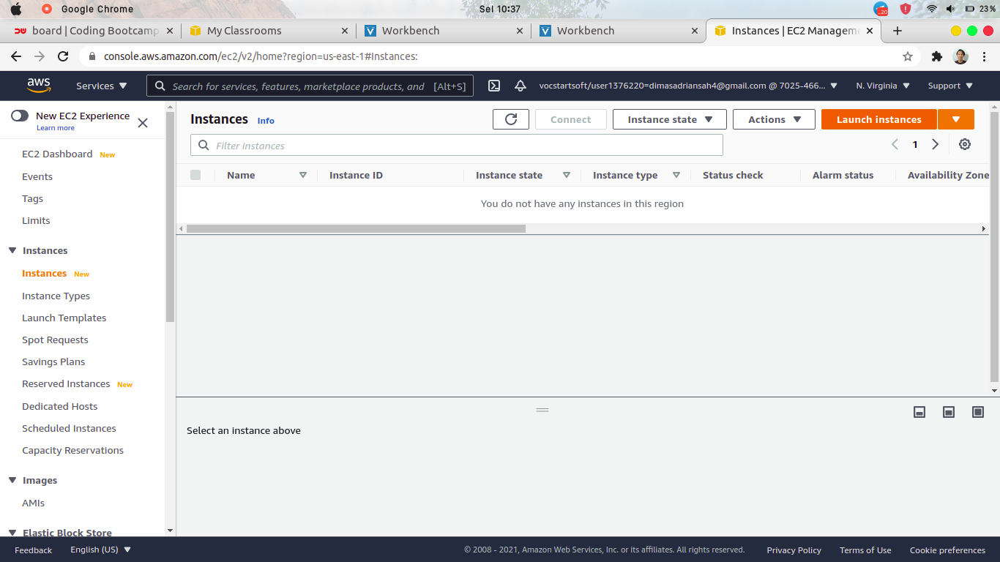
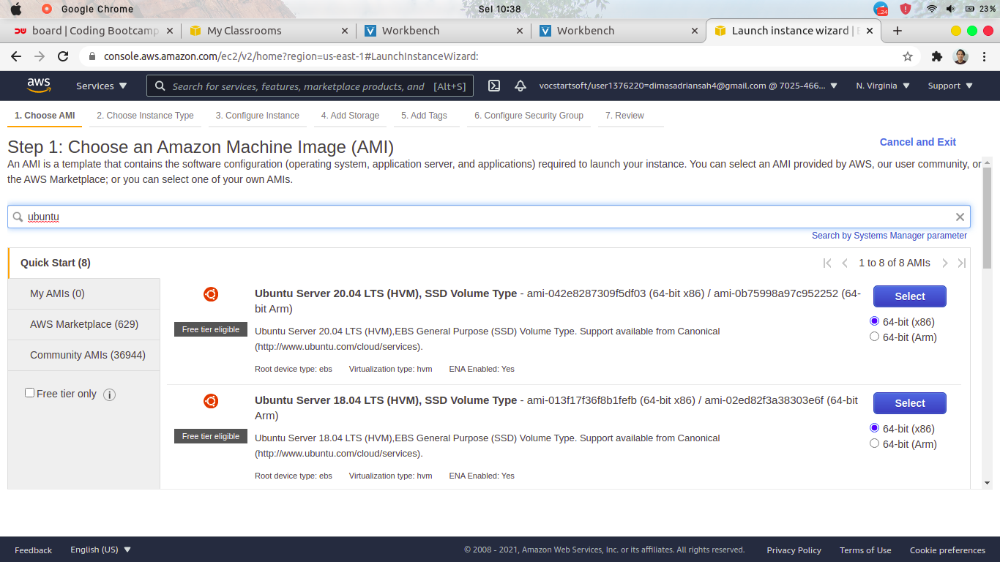
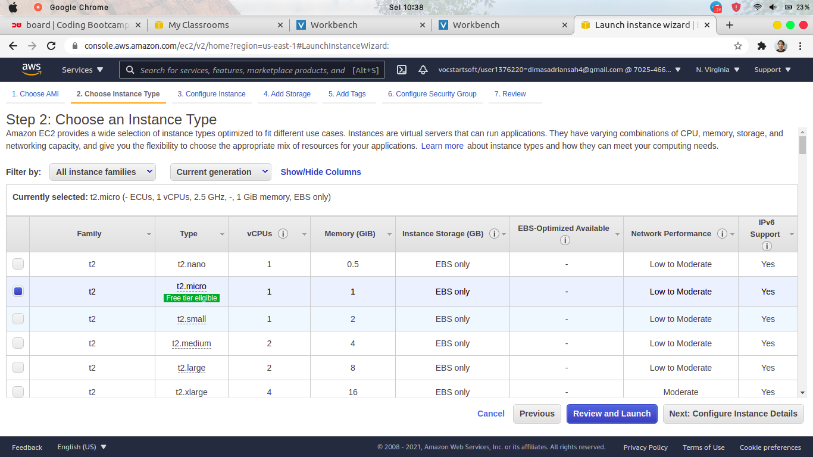
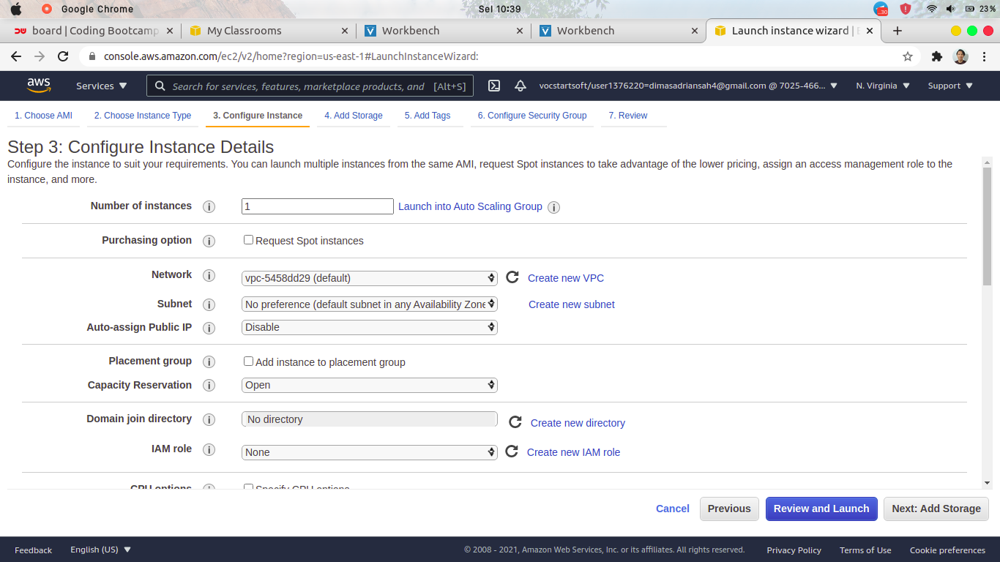
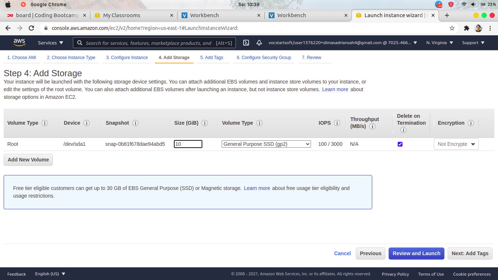
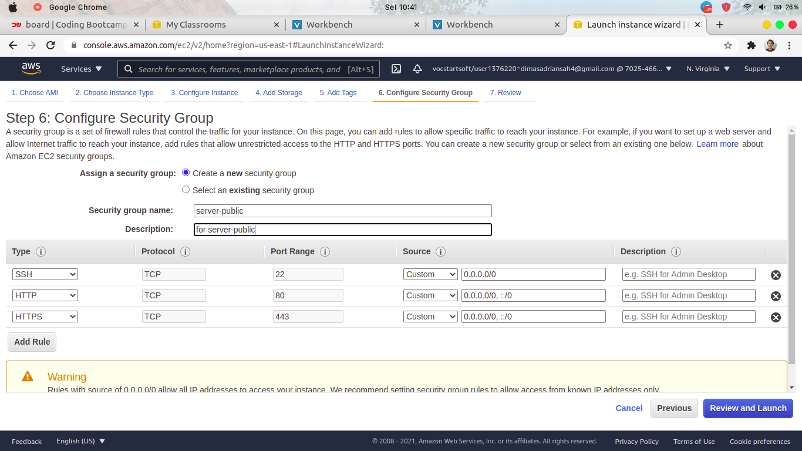

# CREATE & SETUP PUBLIC SERVER FOR REVERSE PROXY

1. AWS Management Console & masuk ke `service > EC2 > Instances` lalu pilih Launch instances

2. pilih OS yang akan dibuat untuk instances, disini saya memilih Ubuntu Server 18.04 LTS

3. pilih spesifikasi type Instance, saya memilih t2.micro

4. pada step Configure Instance Details, yang perlu diubah disini yaitu `Auto-assign Public IP = Disable` untuk yang lainnya biarkan default

5.untuk storage server, saya memberikan sebesar 10 GiB

6. pada Configure Security Group, tambahkan 3 rule `SSH (22), HTTP(80), HTTPS(443)`

