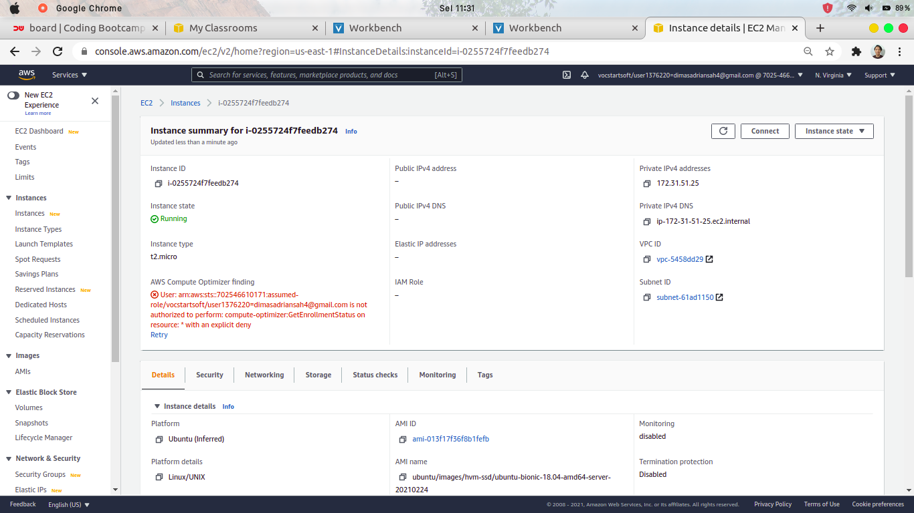
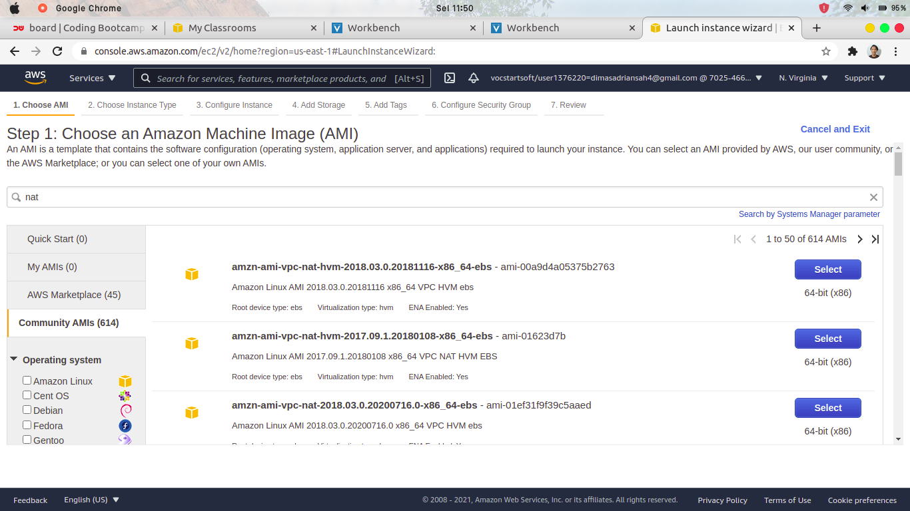
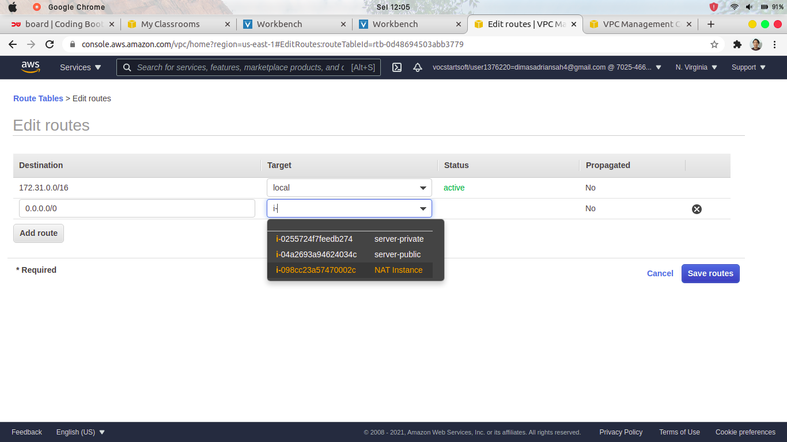

# CREATE & SETUP PUBLIC SERVER FOR REVERSE PROXY

1. masuk ke AWS Management Console & masuk ke `service > EC2 > Instances` lalu pilih Launch instances


2. pilih OS yang akan dibuat untuk instances, disini saya memilih Ubuntu Server 18.04 LTS


3. pilih spesifikasi type Instance, saya memilih t2.micro


4. pada step Configure Instance Details, yang perlu diubah disini yaitu `Auto-assign Public IP = Disable` untuk yang lainnya biarkan default


5.untuk storage server, saya memberikan sebesar 10 GiB


6. pada Configure Security Group, tambahkan 3 rule `SSH (22), HTTP(80), HTTPS(443)`


7. Lalu pilih Review and Launch, jangan lupa membuat key pair untuk login ke instance nantinya. Pilih `Create a new key pair` dan isikan nama key pair dan `Download Key Pair` . Jika sudah, Launch Instances


8. dan instance untuk public telah dibuat


9. selanjutnya, buat elastic IP static untuk dialokasikan ke Instance public 


10. lalu associate elastic ip dengan instance public. Centang Elastic IP yang ada, pilih `Actions > Associate Elastic IP address`


11. pilih `Resource type = Instance` dan pilih `Instance = public-instance` . klik Associate


# CREATE & SETUP PRIVATE SERVER FOR APPLICATION

12. buat lagi instance untuk private server. Pilih OS yang sama yaitu ubuntu server 18.04 LTS


13. pilih t2.micro


14. pada Configure Instance Details, masih sama seperti sebelumnya


15. Tambahkan Storage sebesar 10 Gib


16. pada Configure Security Group disini berbeda dari sebelumnya, yaitu tambahkan rule untuk mengizinkan semua traffic yang masuk


17. jika sudah, Review and Launch lalu pilih key pair yang sebelumnya sudah dibuat.

Setelah instance private dibuat, tidak perlu diberi Elastic IP


# SETUP USER & SSH PUBLIC INSTANCE

18. setelah mendownload key pair untuk kedua instance, ubah permission dari file key pair tersebut

```
sudo chmod 400 key_pair.pem
```


19. lakukan SSH ke server public dengan menggunakan key pair

```
ssh -i key_pair.pem ubuntu@ip-public
```


20. tambahkan user baru untuk jaga-jaga apabila key pair hilang. Jalankan perintah 

```
sudo adduser nama-user
```


21. tambahkan akses sudo untuk user baru tersebut dengan menjalankan perintah

```
sudo usermod -aG sudo nama-user
```


22. edit pada file `/etc/ssh/sshd_config` dan ubah pada bagian `PasswordAuthentication no` menjadi `PasswordAuthentication yes`


23. jika sudah, restart service sshd

```
sudo systemctl restart sshd
sudo systemctl status sshd
```


24. lakukan remote ssh ke server public tanpa menggunakan key pair

```
ssh nama-user@ip-public
```


25. Selanjutnya kita akan mencoba remote SSH server private dari server public

pertama, lakukan transfer key pair dari local ke server public

```
scp key-pair.pem nama-user@ip-public:/server/directory/key-pair.pem
```


26. buka kembali aws management console dan masuk ke `EC2 > Instances > private-server` lalu salin Private IPv4 address



27. selanjutnya, lakukan remote SSH ke server public lalu ke server private. Dan buat user baru seperti sebelumnya


# SETUP VPC (Virtual Private Cloud)

28. pertama, buka aws management console dan masuk ke `service > VPC > subnets`


29. beri nama subnet milik public server menjadi `subnet-id-public-server` dan private server `subnet-id-private-server`


# CREATE & SETUP NAT INSTANCE FOR PRIVATE SERVER

* Supaya private server aman, jangan diberi public ip yang dapat diakses langsung melalui internet. Tapi nantinya akan diakses melalui server public __revers proxy__ . Namun, dengan begitu server private tidak terhubung ke internet, oleh karena itu kita akan membuat NAT intances agar server private dapat terhubung ke internet.

30. Pertama, Launch Instances dan pilih AMI nat



31. disini saya memilih tipe Instance yang sederhana yaitu t2.micro


32. pada Configure Instance Details yang perlu diubah yaitu Subnet, pilih public subnet dan `enable Auto-assign Public IP` 


33. pada Security Group, tambahkan 1 rule dengan setup type __all traffic__ dan source ip dari network/subnet-server-private


34. selanjutnya masuk ke list instances, centang NAT instances dan klik `Action > Networking > Change source/destination check`


35. pada settingan ini ceklis __stop__ dan klik save


36. jika sudah, masuk ke `service > VPC > Route Tables` lalu klik `Create route table`


37. kita bikin route table baru untuk private server, pilih VPC dari Subnet ID private server. klik Create


38. selanjutnya `Edit routes` dari route table yang telah kita buat


39. `Add route` dan pilih `Target` NAT Instance. __Save routes__



40. jika sudah, pergi ke `VPC > Subnets > subnet-private-server` lalu klik `Edit route table association`


41. lalu associate route table tadi dengan subnet private. klik __Save__


42. test ping ke internet dari private server


 

