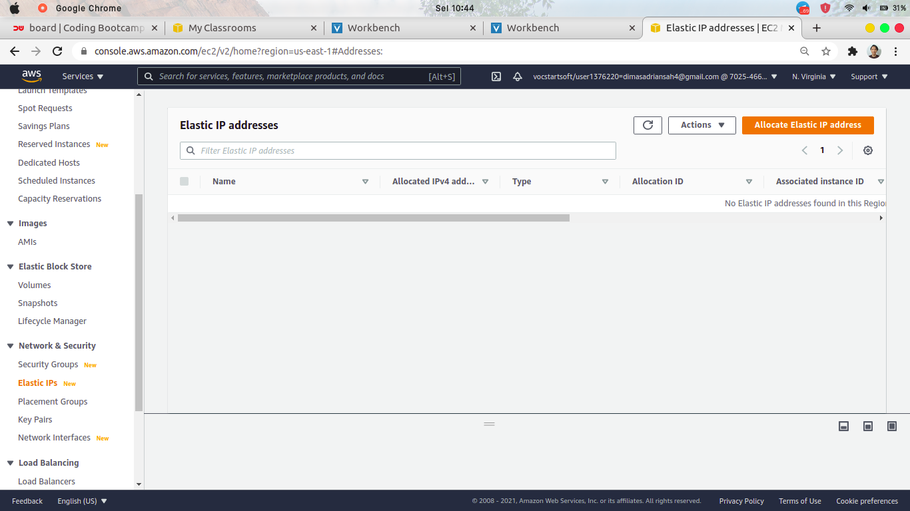

# CREATE & SETUP PUBLIC SERVER FOR REVERSE PROXY

1. masuk ke AWS Management Console & masuk ke `service > EC2 > Instances` lalu pilih Launch instances


2. pilih OS yang akan dibuat untuk instances, disini saya memilih Ubuntu Server 18.04 LTS


3. pilih spesifikasi type Instance, saya memilih t2.micro


4. pada step Configure Instance Details, yang perlu diubah disini yaitu `Auto-assign Public IP = Disable` untuk yang lainnya biarkan default


5.untuk storage server, saya memberikan sebesar 10 GiB


6. pada Configure Security Group, tambahkan 3 rule `SSH (22), HTTP(80), HTTPS(443)`


7. Lalu pilih Review and Launch, jangan lupa membuat key pair untuk login ke instance nantinya. Pilih `Create a new key pair` dan isikan nama key pair dan `Download Key Pair` . Jika sudah, Launch Instances


8. dan instance untuk public telah dibuat


9. selanjutnya, buat elastic IP static untuk dialokasikan ke Instance public 




10. lalu associate elastic ip dengan instance public. Centang Elastic IP yang ada, pilih `Actions > Associate Elastic IP address`


11. pilih `Resource type = Instance` dan pilih `Instance = public-instance` . klik Associate


# CREATE & SETUP PRIVATE SERVER FOR APPLICATION

12. buat lagi instance untuk private server. Pilih OS yang sama yaitu ubuntu server 18.04 LTS


13. pilih t2.micro


14. pada Configure Instance Details, masih sama seperti sebelumnya


15. Tambahkan Storage sebesar 10 Gib


16. pada Configure Security Group disini berbeda dari sebelumnya, yaitu tambahkan rule untuk mengizinkan semua traffic yang masuk


17. jika sudah, Review and Launch lalu pilih key pair yang sebelumnya sudah dibuat.

Setelah instance private dibuat, tidak perlu diberi Elastic IP


# SETUP USER & SSH PUBLIC INSTANCE

18. setelah mendownload key pair untuk kedua instance, ubah permission dari file key pair tersebut

```
sudo chmod 400 key_pair.pem
```


19. lakukan SSH ke server public dengan menggunakan key pair

```
ssh -i key_pair.pem ubuntu@ip-public
```


 

