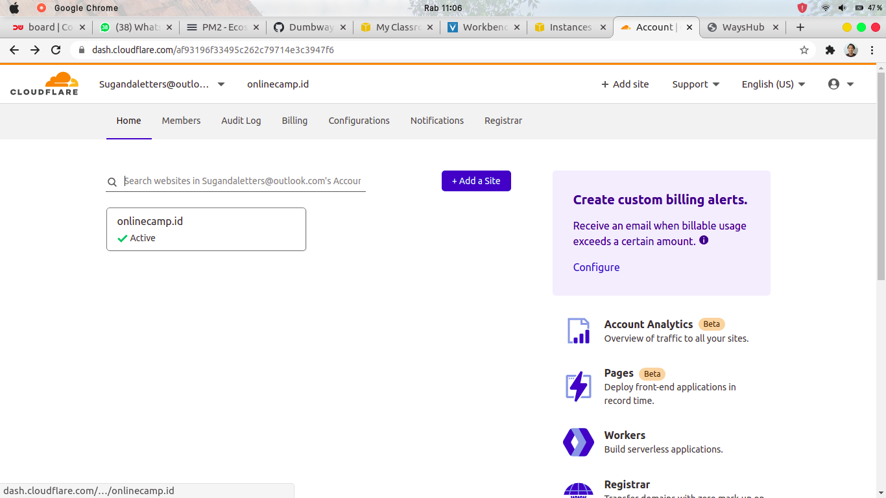
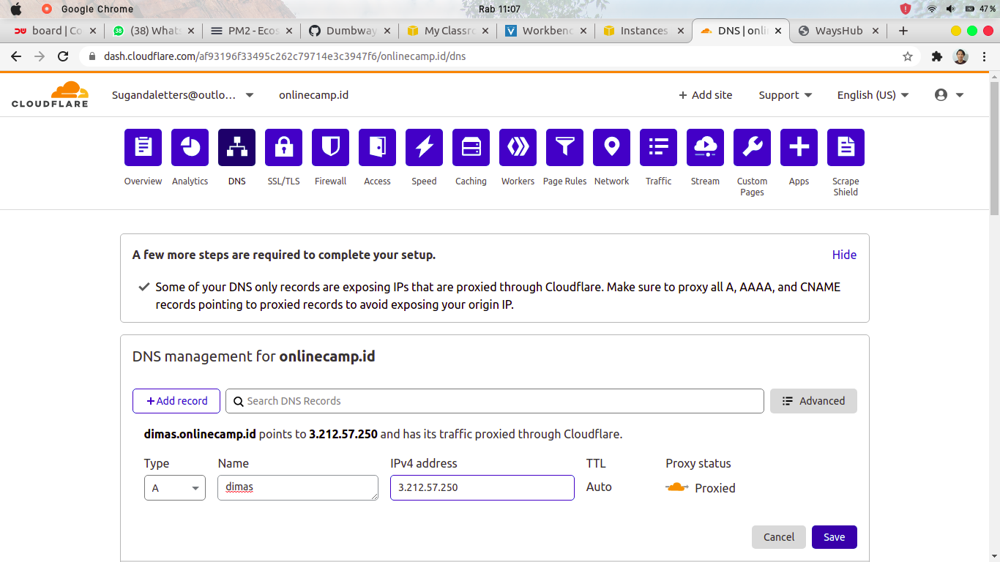
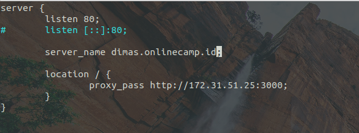
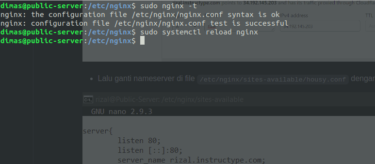
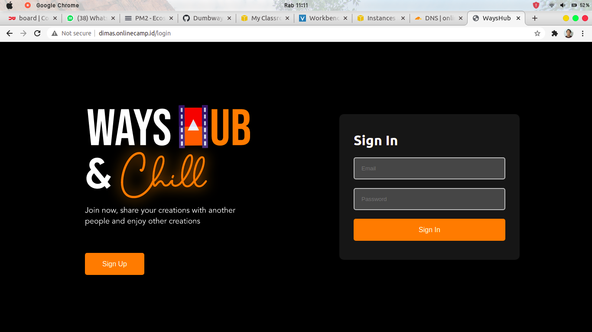

# CUSTOM DOMAIN

1.  pertama buka browser dan login ke cloudflare, di __Home__ klik domain yang tersedia. Disini saya mempunyai domain `onlinecamp.id`



2. pilih __DNS__ dan tambahkan subdomain. `Name = <nama subdomain>` `IPv4 address = IP Public` klik save



3. lalu edit file pada `/etc/nginx/wayshub/frontend` dan ubah `server_name <subdomain>`



4. cek konfigurasi dan reload layanan nginx 

```
sudo nginx -t
sudo systemctl reload nginx
```



5. buka browser dan masukkan subdomain pada URL. Jika tampilan frontend terlihat, maka subdomain berhasil diterapkan




