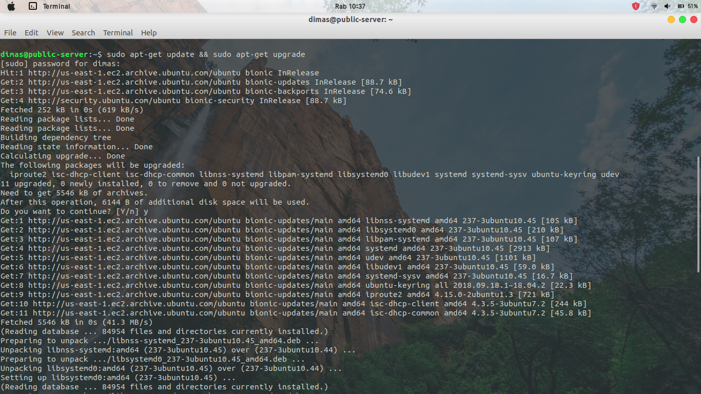
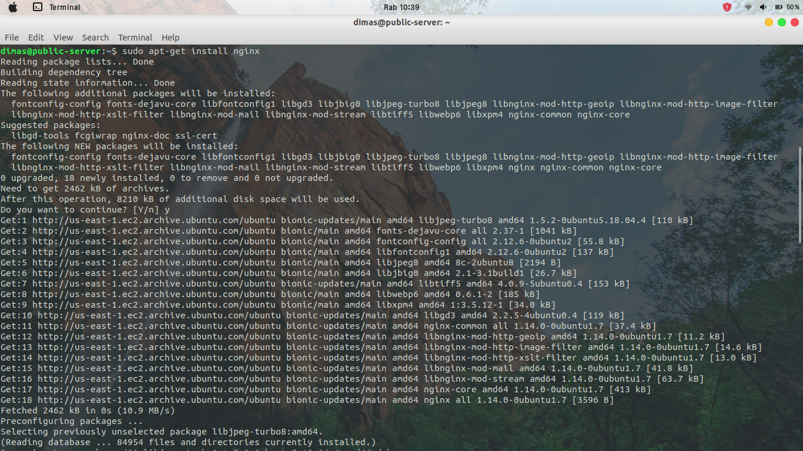
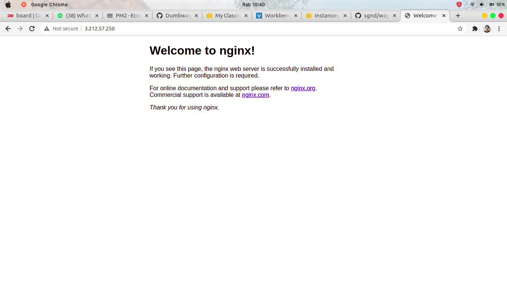
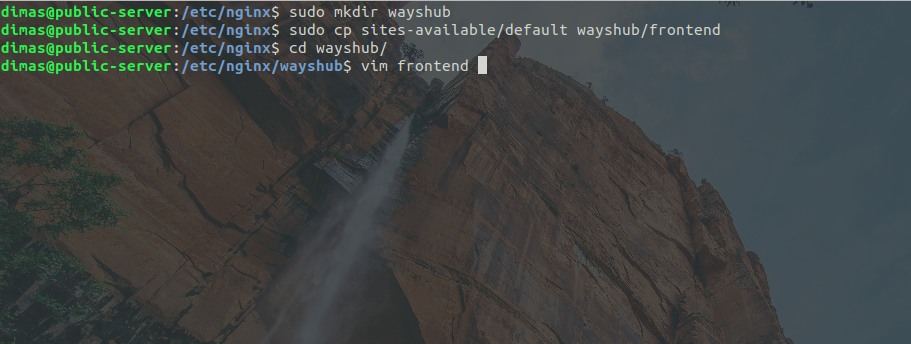
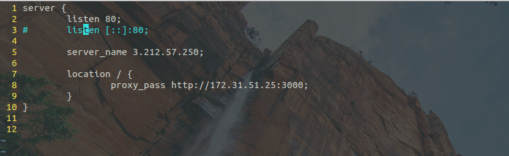
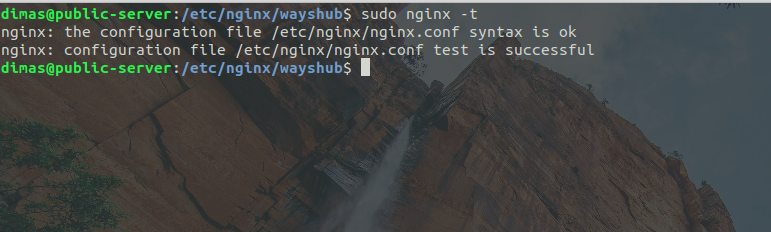
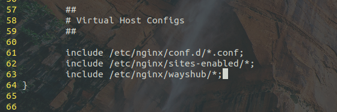
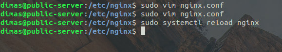
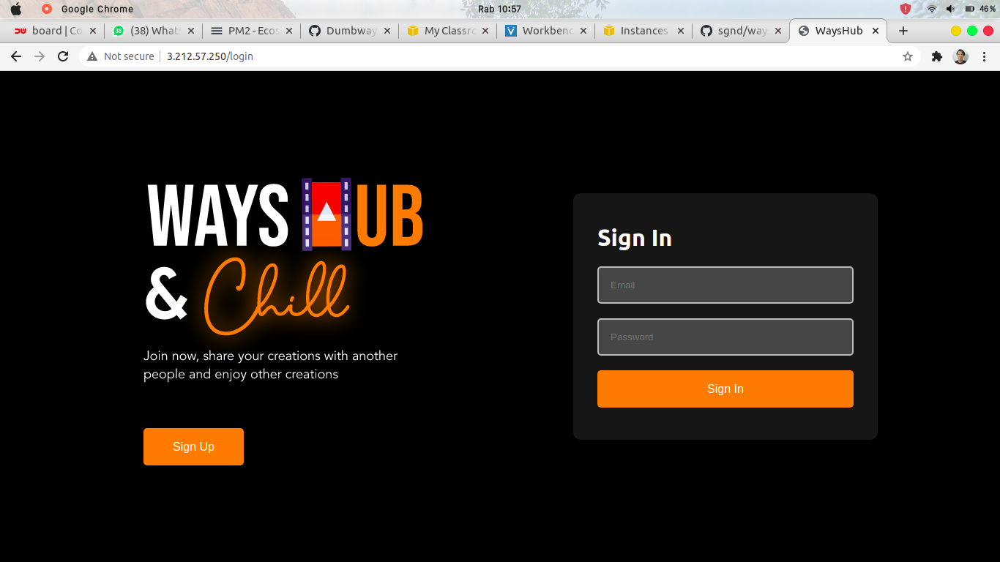

# SETUP REVERSE PROXY

1. Pertama, update & upgrade system pada public server, lalu install nginx

```
sudo apt-get update
sudo apt-get upgrade
sudo apt-get install nginx -y
```




2. cek melalui browser dengan memasukkan ip public server pada URL



3. selanjutnya masuk ke direktori `/etc/nginx` , lalu buat direktori baru `wayshub` dan salin file pada `sites-available/default` menjadi ke `wayshub/frontend`

jika sudah, edit file `/wayshub/frontend`

```
cd /etc/nginx
sudo cp sites-available/default wayshub/frontend
cd wayshub
sudo vim frontend
```



4. isikan seperti konfigurasi dibawah ini, `server_name <ip public server>` `proxy_pass <ip private server:port>` dan listen ke port 80



5. cek konfigurasi nginx apakah sudah benar 

```
sudo nginx -t
```



6. selanjutnya edit file pada `/etc/nginx/nginx.conf` dan masukan konfigurasi include rute ke direktori `etc/nginx/wayshub/*;`



7. terakhir, reload layanan nginx untuk menerapkan perubahan konfigurasi

```
sudo systemctl reload nginx
```



8. cek reverse proxy pada browser dengan memasukkan ip public pada URL, jika berhasil berarti reverse proxy sudah bekerja




