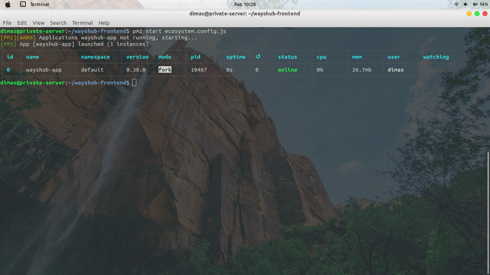

# SERVER FOR APPLICATION (Private Server)

1. lakukan update & upgrade pada system private server

```
sudo apt-get update
sudo apt-get upgrade
```


2. jika sudah, install nvm melalui link bash script dan restart bash nya. Lalu cek versi nvm

```
curl -o- htpps://raw.githubusercontent.com/nvm-sh/nvm/v0.38.0/install.sh | bash
exec bash
nvm -v
```


3. selanjutnya install nodejs versi 14 melalui nvm dan cek versinya

```
nvm install 14
nvm list
node -v
npm -v
```


4. setelah itu, clone repository wayshub-frontend ke private server kita dan masuk ke direktori repo tersebut

```
git clone http://github.com/sgnd/wayshub-frontend.git
cd wayshub-frontend
```


5. masukkan perintah `npm i` untuk menginstall modules packages yang ada


6. jika sudah, install pm2 dengan memasukkan perintah 

```
npm install -g pm2
```  


7. jalankan perintah `pm2 ecosystem` untuk men-generate file `ecosystem.config.js`


8. edit file `ecosystem.config.js` dan isikan seperti configurasi dibawah ini


9. masukkan perintah `pm2 start ecosystem.config.js` untuk memulai running aplikasi


