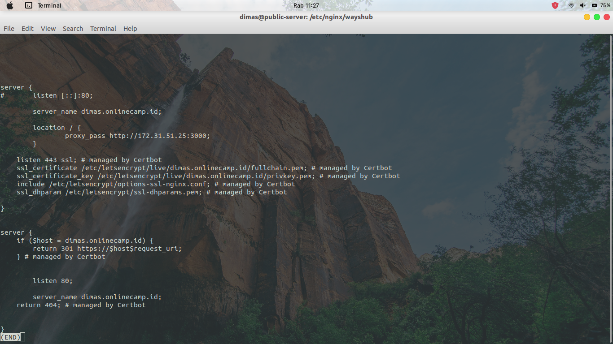

# SSL CONFIGURATION

1. update system dan install certbot

```
sudo apt-get update
sudo apt-get install python-certbot-nginx
```


2. masuk ke direktori `/etc/nginx/wayshub` dan masukkan perintah `sudo certbot -d dimas.onlinecamp.id` dan ikuti arahan dari output


3. jika sudah, cek file pada `/etc/nginx/wayshub/frontend` maka konfigurasi https akan otomatis diisi



4. cek HTTPS SSL pada browser


