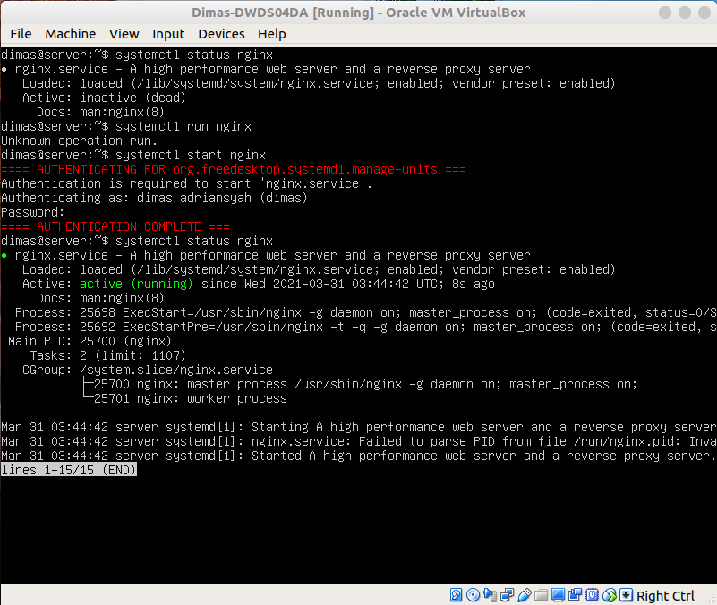
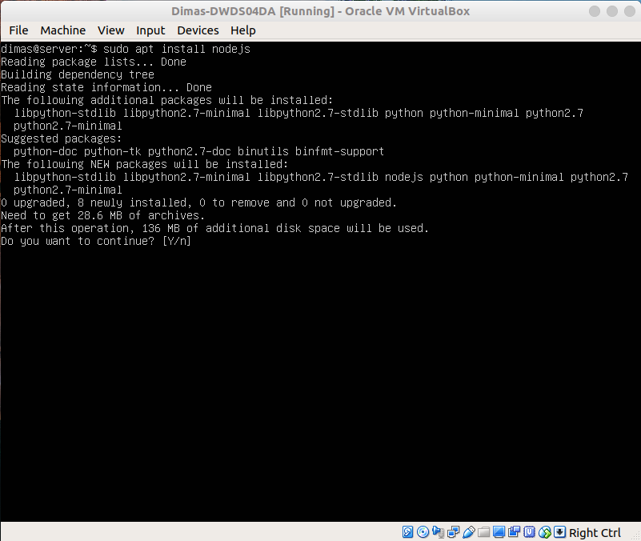

# INSTALL NGINX AND DEPLOY NODEJS APPLICATION ON SERVER
## Instalasi nginx

1. pertama, login ke VM server lakukan update dan upgrade system dengan mengetikkan perintah `sudo apt update && sudo apt upgrade`

2. setelah itu, ketikkan perintah `sudo apt install nginx-light` untuk melakukan instalasi web server nginx

3. jika proses instalasi selesai, ketikkan perintah `systemctl start nginx` untuk menjalankan layanan nginx. Pastikan layanan nginx sudah berjalan, ketikkan perintah `systemctl status nginx` untuk melihat status dari layanan nginx yang terinstall pada server kita

4. untuk percobaan mengakses, buka browser dan masukkan ip dari server

## Instalasi nodejs dan deploy wayshub application frontend

5. pertama, lakukan instalasi nodejs versi 14.x, kita akan menginstall melalui URL bash script dari nodesource. ketikkan perintah `curl -fsSL https://deb.nodesource.com/setup_14.x | sudo -E bash -` dan ketikkan perintah `sudo apt-get install -y nodejs`

6. ketikkan perintah `node -v` untuk melihat dari versi nodejs yang sudah kita install

7. selanjutnya, clone repository dari `https://github.com/sgnd/wayshub-frontend.git` ke server kita dengan mengetikkan perintah `git clone https://github.com/sgnd/wayshub-frintend.git` . Jika sudah, masuk ke direktori repo tersebut

8. ketikkan perintah `npm i` untuk menginstall modul package yang dibutuhkan

9. ketikkan perintah `npm run build` untuk build semua package dan `npm run start` untuk menjalankan aplikasi frontend yang ada di server kita

10. untuk coba mengakses aplikasi, buka browser dan masukan ip server pada URL menggunakan port 3000. ex: `192.168.43.200:3000`

