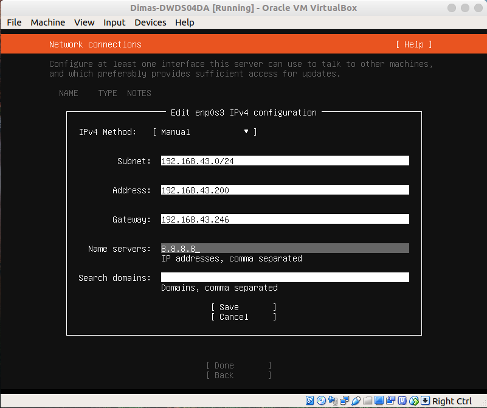

# INSTALL UBUNTU SERVER 18.04 IN VIRTUAL BOX

1. masuk ke halaman awal virtual box dan pilih New, lalu isikan nama, NIS, type Linux dan version. Next

2. tentukan berapa banyak RAM yang akan diberikan, disini saya memberikan 1024 MB. Next

3. pilih Create a virtual hard disk now

4. pilih VDI

5. pilih Dynamically allocated

6. tentukan lokasi penyimpanan virtual hard disk file dan jumlah ukuran hard disk

7. buka menu settings untuk VM yang sudah dibuat tadi, pada submenu storage tambahkan file iso ubuntu server untuk diinstal nantinya

8. pada submenu system, ubah urutan boot order seperti dibawah agar proses booting berjalan baik dan tak perlu mengubah instalasi boot setelah selesai install

9. pada submenu network, pilih bridged adapter dan pilih Name adapter yang mengarah ke wlan host

10. setelah selesai itu, nyalakan VM yang sudah kita buat dan ikuti langkah-langkah dibawah ini

11. pada bagian instalasi configuration interface kita ubah menjadi static agar IP tidak berubah ubah ketika VM reboot, pilih interface yang ada lalu pilih Edit IPv4

12. Isikan agar satu segmen IP dengan host, disini IP host wlan saya adalah 192.168.43.246

