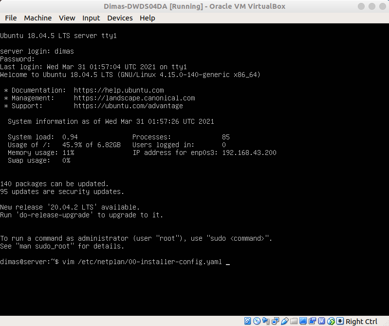

# SETUP NETWORK STATIC IP ON VM

1. buka virtual box, masuk ke menu settings VM yang dipilih. Pada submenu Network, ubah network adapter menjadi Bridge Adapter dan pilih interface host yang terhubung ke internet

2. selanjutnya, login ke VM dan edit file `/etc/netplan/00-installer-config.yaml`

3. tuliskan konfigurasi file seperti dibawah ini

4. ketikkan perintah `sudo netplan apply` untuk menerapkan perubahan network dan perintah `ip a` untuk melihat informasi pada setiap interfaces. Lakukan perintah `ping -c 4 8.8.8.8` untuk mengetahui apakah VM terhubung ke internet atau tidak

5. terakhir, lakukan percobaan ssh pada sisi host ke VM dengan menggunakan perintah `ssh -l <username> <ip tujuan>`

