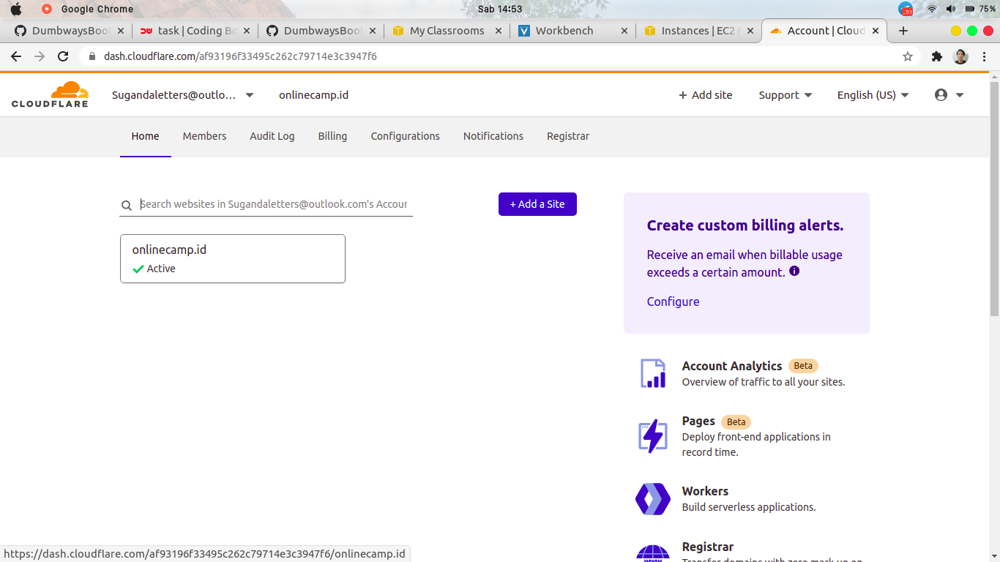
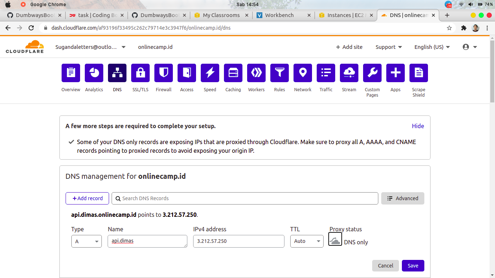
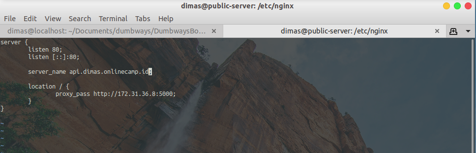
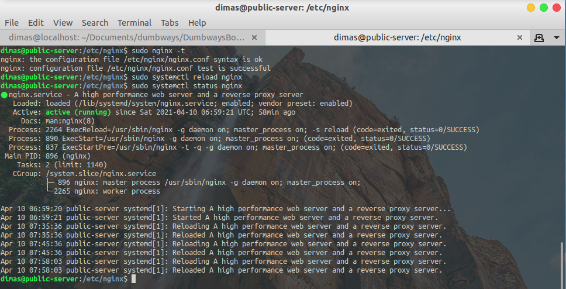

# CUSTOM DOMAIN FOR API BACKEND

1. login dan masuk ke halaman cloudflare. Pada menu home, pilih domain yang tersedia

2. pilih DNS, klik `+ Add record`, lalu buat subdomain untuk api dan matikan proxy. (masih menggunakan ip public reverse proxy yang sama)

3. selanjutnya, login ke server reverse-proxy dan edit file config `/etc/nginx/wayshub/backend`, ubah pada bagian `server_name` menjadi subdomain api

4. jika sudah, jangan lupa untuk cek file config nginx dan restart layanan nginx

