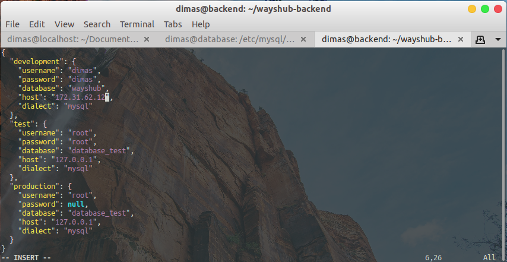
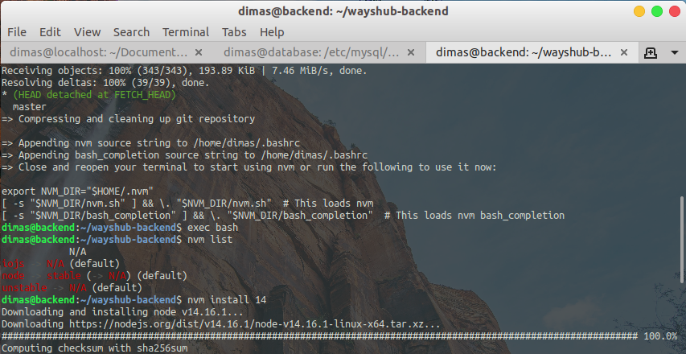
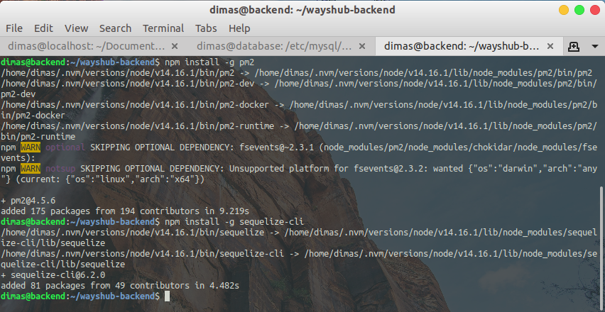
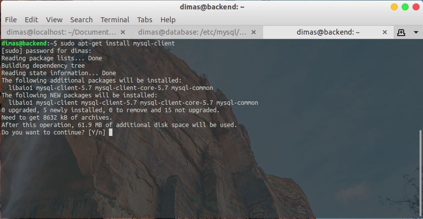
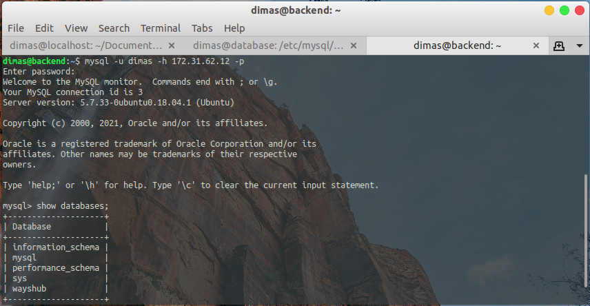
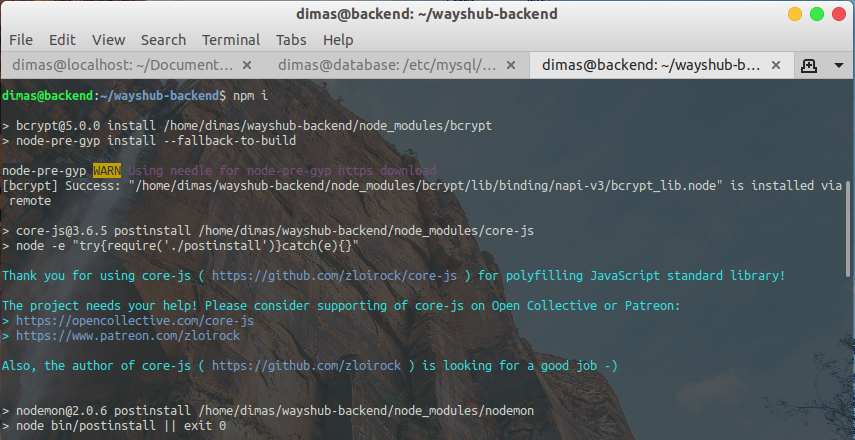
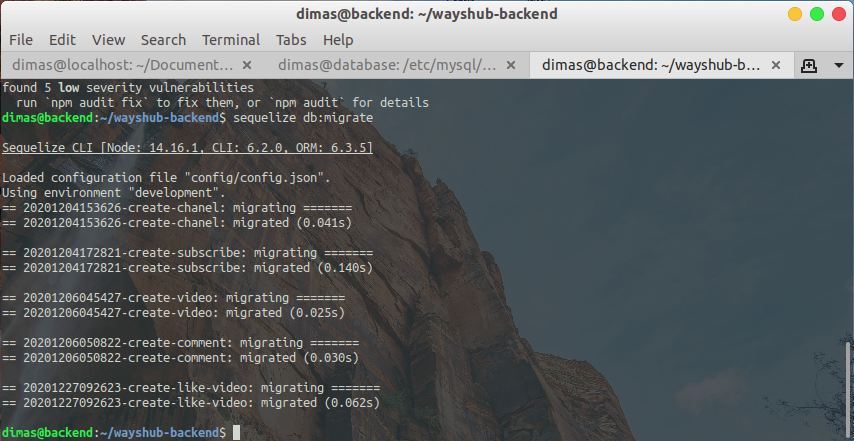
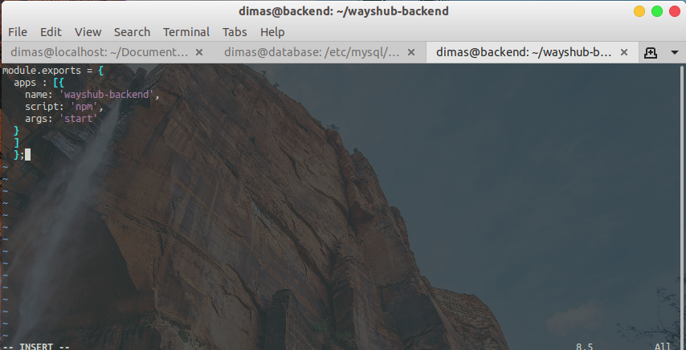
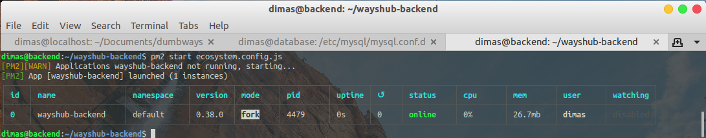

# DEPLOYMENT BACKEND APPLICATION

1. Pertama, Remote dan login ke `private-server-backend`, lalu edit file pada `~/wayshub-backend/config/config.json` dan ubah untuk development

```
"development": {
	"username": "<user-mysql>",
	"password": "<password-user-mysql>",
	"database": "<nama-databases>",
	"host": "<ip-server-database>",
	"dialect": "mysql"
}
```



2. lalu install `nvm` untuk menginstall dan memanage versi dari `nodejs`

```
curl -o- https://raw.githubusercontent.com/nvm-sh/nvm/v0.38.0/install.sh | bash
exec bash
nvm install 14
```



3. jika sudah, install `pm2` untuk runtime nodejs application dan `sequelize` untuk migrasi database

```
npm install -g pm2
npm install -g sequelize-cli
```



4. setelah itu lakukan penginstallan `mysql-client` sebelum kita migrasi database menggunakan `sequelize`

```
sudo apt-get install mysql-client
```



5. login ke mysql yang ada pada `private-server-database` dan tampilkan databases yang ada

```
mysql -u <nama-user> -h <ip-server-database> -p
show databases;
```



6. selanjutnya `exit` dari mysql, dan masuk ke direktori `~/wayshub-backend` lalu install modules serta packages yang dibutuhkan dengan menjalankan perintah

```
npm i
```



7. setelah itu lakukan migrate database dengan menjalankan perintah

```
sequelize db:migrate
```



8. lalu generate file ecosystem.config.js menggunakan `pm2` dan edit file yang telah kita generate tersebut

```
pm2 ecosystem
```



9. jika sudah, jalankan perintah `pm2 start ecosystem.config.js` untuk run starting aplikasi




