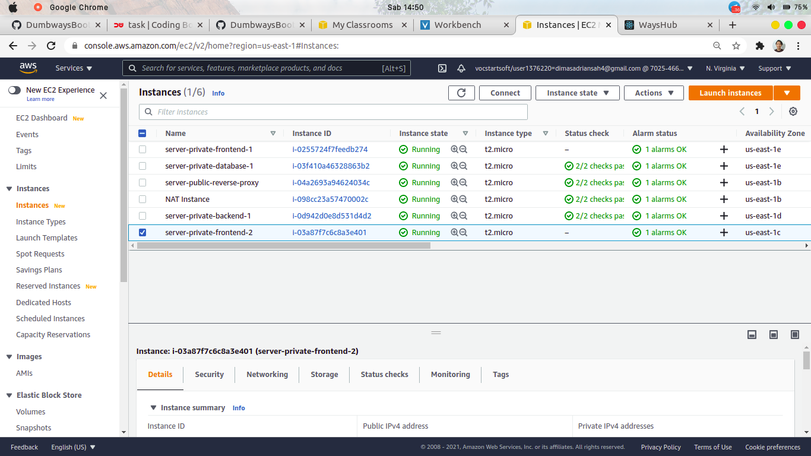
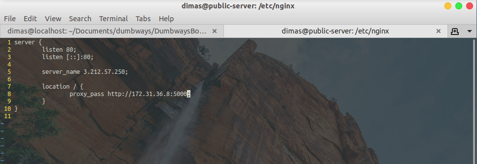
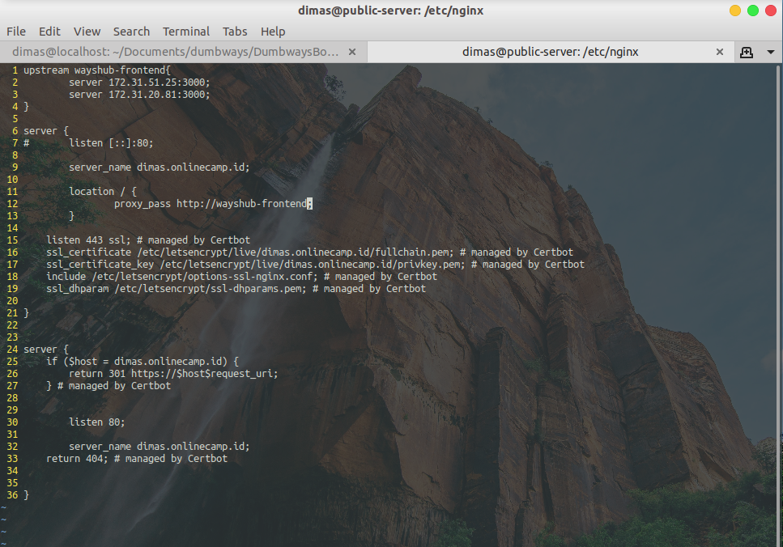
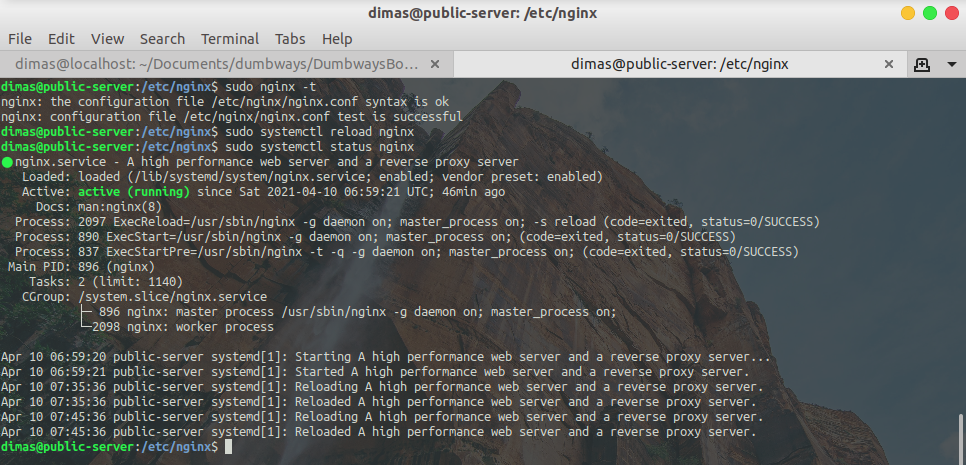

# REVERSE PROXY

1. disini saya membuat tambahan 2 private instances frontend (load balancing), 1 private instances backend



2. lakukan remote ssh ke server reverse-proxy untuk membuat file config baru untuk `backend` dan edit file `frontend` menjadi loadbalancing

```
cd /etc/nginx/wayshub
sudo touch backend
```

`backend`



`frontend`

disini saya menambahkan script configuration baru yaitu

```
upstream wayshub-frontend{
	server <ip-server-frontend-1>:<port>;
	server <ip-server-frontend-2>:<port>;
}
```

dan location proxy pass yang mengarah ke upstream

```
location / {
	proxy_pass http://<upstream server>;
}
```



4. jika sudah, cek status file configurasi nginx dan restart layanan nginx

```
sudo nginx -t
sudo systemctl reload nginx
sudo systemctl status nginx
```


