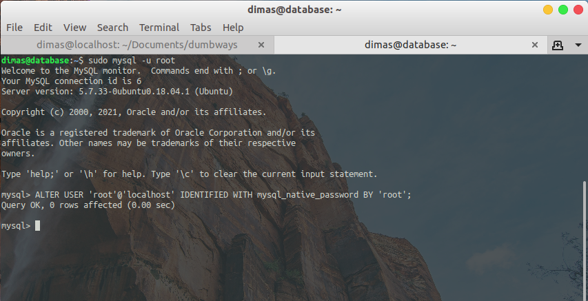

# SETUP DATABASE

1. Pertama, buat private instance database baru


2. install `mysql-server` dengan perintah

```
sudo apt-get install mysql-server
```


3. jika sudah terinstall, masuk ke mysql dengan menggunakan user root

```
sudo mysql -u root
```

jika ingin merubah password user root, jalankan perintah

```
ALTER USER 'root'@'localhost' IDENTIFIED WITH mysql_native_password BY 'password';
```



4. tampilkan databases untuk melihat databases yang ada dan buat databases baru

```
show databases;
create database wayshub;
```


5. selanjutnya, kita akan membuat user mysql baru untuk `server-private-backend` agar dapat login ke mysql di `server-private-databases`

```
create user '<user-baru>'@'<ip-server-backend>' identified by '<password-baru>';
grant all on *.* to '<user-baru>'@'ip-server-backend';
FLUSH PRIVILEGES;
```


6. edit bind-address pada `/etc/mysql/mysql.conf.d` dan isikan `bind address = 0.0.0.0` agar ip nya dapat diakses oleh `server-private-backend`


7. jika sudah, restart layanan mysql pada server dan cek statusnya

```
sudo systemctl restart mysql.service
sudo systemctl status mysql.service
```


