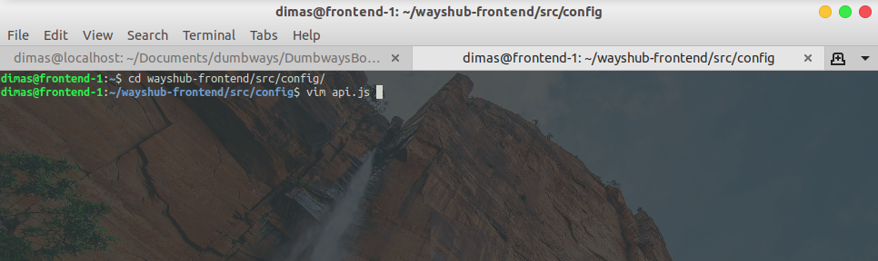

# SSL CONFIGURATION BACKEND

1. login ke server `reverse-proxy` dan lakukan konfigurasi SSL untuk subdomain `api.dimas.onlinecamp.id` menggunakan certbot dengan perintah

```
sudo certbot --nginx -d api.dimas.onlinecamp.id
```


2. jika sudah, login ke server `frontend` dan edit file `wayshub-frontend/src/config/api.js`



3. ubah pada bagian `baseURL: ` dengan subdomain api


4. selanjutnya lakukan run frontend menggunakan `pm2` dengan perintah

```
pm2 start ecosystem.config.js
```


5. buka browser dan masukan URL backend untuk memastikan apakah konfigurasi SSL berhasil


6. selanjutnya cobalah sign up dan sign in pada aplikasi


