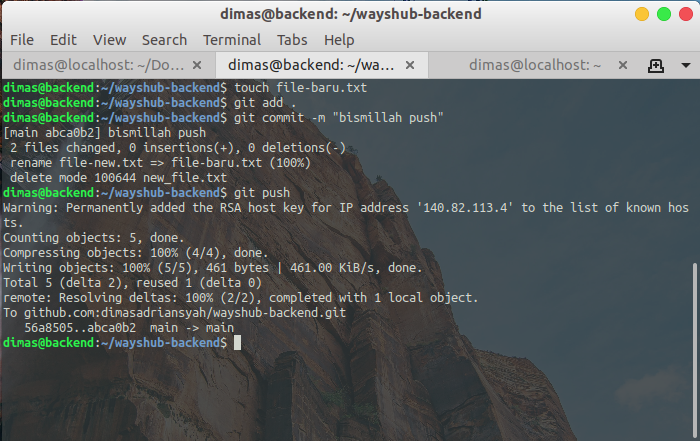

# INSTALL GIT AND SSH KEY

1. pertama, buat private instance backend


2. edit inbound rules dari __security group__ yang dipakai NAT Instances dan tambahkan 1 rule dengan setup type __all traffic__ dan __source ip__ dari network/subnet-server-private-backend


3. masuk ke `Services > VPC > Subnets` dan ceklis pada __subnet ID backend__, lalu klik `Actions > Edit route table association`


4. pada __Route table ID__, pilih __private-route__ yang pernah kita buat sebelumnya, klik save


5. lakukan ping ke `8.8.8.8` pada server backend


6. selanjutnya, fork repository __wayshub-backend__ dari `https://github.com/sgnd/wayshub-backend`


7. login ke server backend, dan masukan perintah dibawah untuk men-generate ssh-key

```
ssh-keygen -t rsa -b 4096
```


8. lalu lihat isi dari key yang sudah kita generate dan salin isinya

```
cat .ssh/id_rsa.pub
```


9. pergi ke halaman `Github > Settings > SSH and GPG keys` dan masukkan SSH key yang sudah kita salin


10. selanjutnya lakukan autentikasi SSH ke github dengan menjalankan perintah dibawah pada server backend

```
ssh -T git@github.com
```


11. clone repo wayshub-backend menggunakan SSH


12. terakhir, cobalah dengan menambahkan file baru pada repo dan lakukan push. Dan hasilnya tidak perlu memasukkan username dan password akun github




