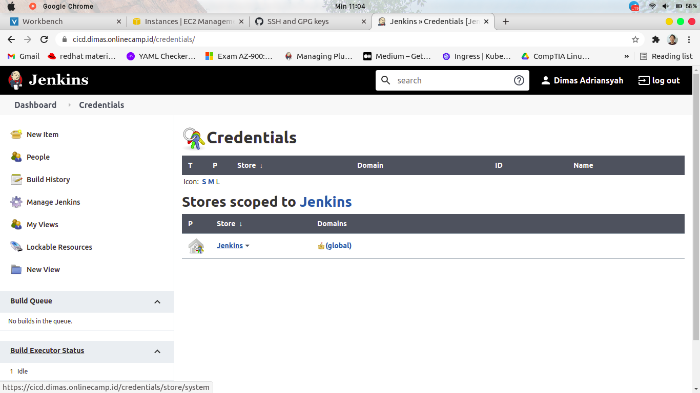

# CREATE JENKINS JOB

1. login ke server jenkins, lakukan generate ssh-keygen dan salin public-key

```
ssh-keygen -t rsa -b 4096 -C "jenkins@cicd.dimas.onlinecamp.id"
cat .ssh/id_rsa.pub
```


2. masukan public-key server jenkins yang sudah disalin ke akun github


3. login ke server-frontend, dan buat file `.ssh/authorized_keys` , salin lagi public-key jenkins ke file tersebut


4. masuk ke jenkins pada browser, dan install plugin yang dibutuhkan yaitu `Publish Over SSH`


5. masuk ke `Manage Jenkins` dan pilih `Manage Credentials`


6. pilih `jenkins`



7. pilih `Global credentials`


8. klik `Add Credentials`


9. isikan `ID`, `Description` , `Username` , `Private-key` yang ada pada server jenkins


10. sealnjutnya, masuk ke `Manage Jenkins` > `Configure System` 


11. pilih `Add server` dan tambahkan server untuk frontend

*exec timeout set : 0*


12. kembali ke halaman utama jenkins lalu create a job


13. isikan nama dan pilih `Freestyle project`


14. isi sebuah description bebas


15. pada bagian `Source Code Management` , pilih `Git` lalu isikan repo URL SSH dan pilih credentials yang sudah dibuat sebelumnya lalu pilih branch master


16. pada bagian `Build Triggers`, ceklis `Github hook trigger for GITscm polling` untuk mentrigger jenkins ketika ada push baru dari repo 


17. pada bagian `Build` , add build `send files or execute commands over ssh` dan tentukan apa yang akan dilakukan


18. pergi ke `Github` dan masuk ke menu `Repository` > `Settings` > `Webhooks` , lalu isikan subdomain dari server jenkins itu sendiri


19. pastikan server frontend dapat terhubung ke repo karena nanti akan dilakukan `git pull origin master` , coba lakukan push


20. maka jenkins akan melakukan proses job nya secara otomatis jika ada push terbaru pada repo


