# INSTALL JENKINS

1. pertama, buat private instance untuk `jenkins` dan pastikan sudah terhubung

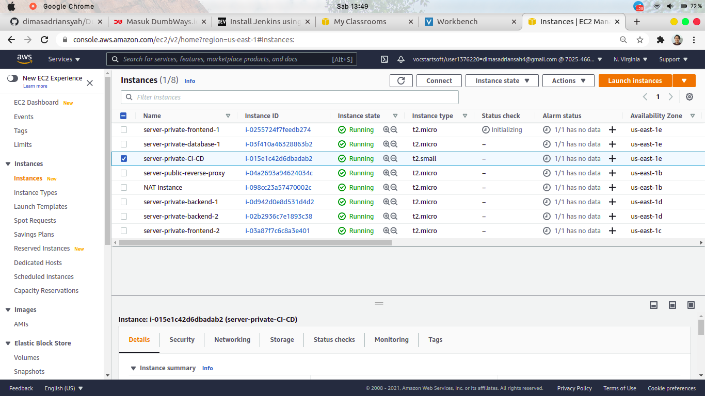

2. login ke instances `jenkins` , lalu pastikan `Docker` & `docker-compose` sudah terinstall di server 

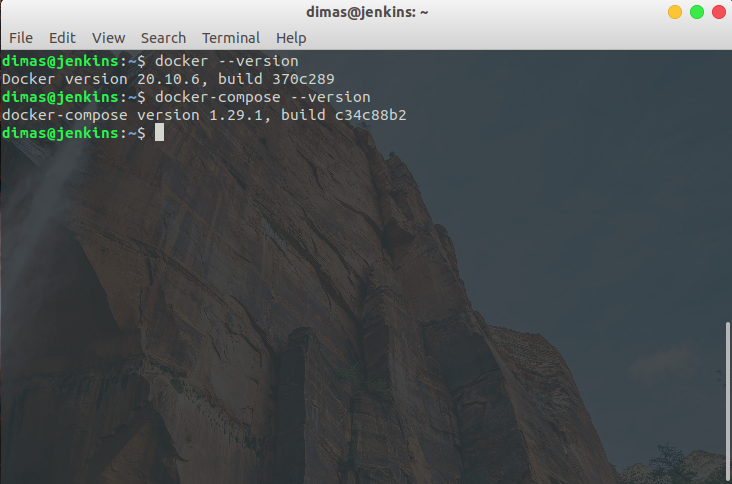

*sebelum ke langkah-langkah, lakukan setup docker-compose auto run terlebih dahulu pada server jenkins*

3. buat direktori `jenkins` yang nantinya akan di mount volumes ke direktori `/var/jenkins_home` pada container jenkins, dan buat file `docker-compose.yml`

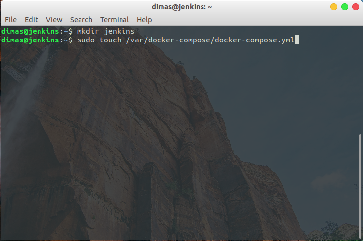

4. edit file `/var/docker-compose/docker-compose.yml` seperti berikut

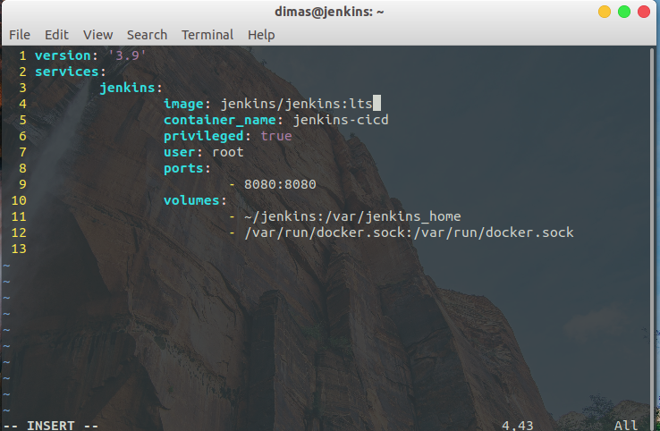

5. jika sudah, `enable` service docker-compose agar berjalan secara auto run setelah booting

```
sudo systemctl enable --now docker-compose.service
```

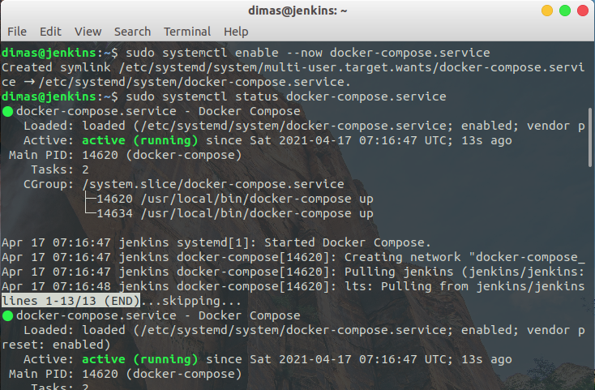

6. selanjutnya, login ke cloudflare dan buat subdomain baru untuk instances `jenkins`

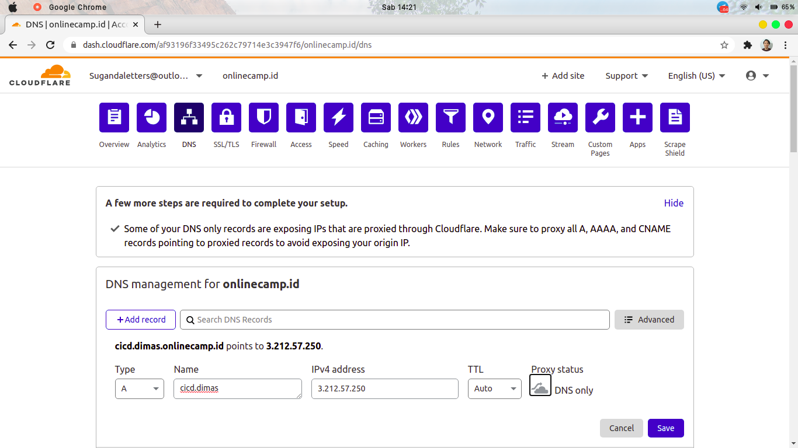

7. jika sudah, login ke `public-server` dan buat file config baru untuk jenkins

```
sudo touch /etc/nginx/wayshub/jenkins
sudo vim /etc/nginx/wayshub/jenkins
```

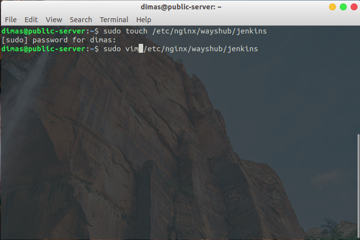

8. edit file config `jenkins` seperti berikut

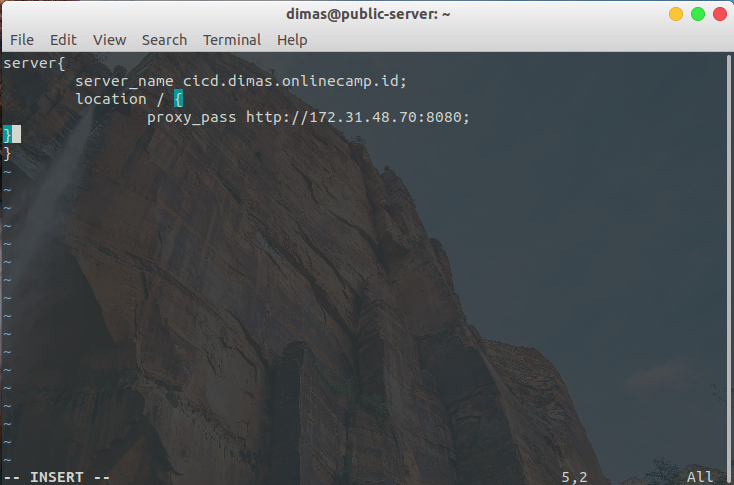

9. lalu lakukan SSL configuration untuk subdomain `cicd.dimas.onlinecamp.id` menggunakan `certbot`

```
sudo certbot --nginx -d cicd.dimas.onlinecamp.id
```

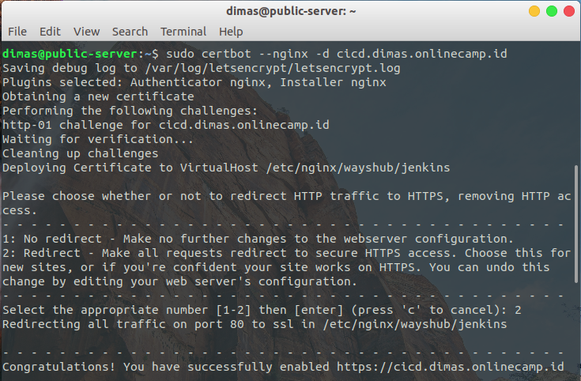

10. dan configuration file jenkins akan secara otomatis terisi SSL

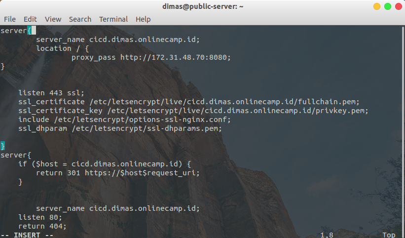

11. reload service nginx

```
sudo nginx -s reload
```

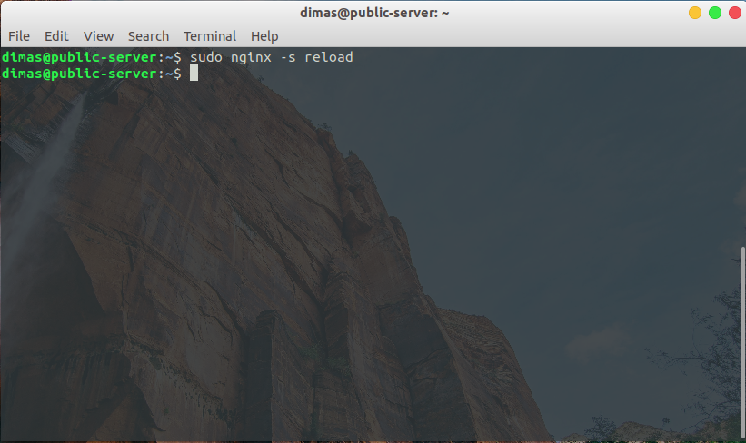

12. kembali ke `server-jenkins` dan pastikan container sudah running. Jangan lupa untuk menyalin password authentication untuk unlock jenkins

```
docker ps
docker exec -it <container-name> cat /var/jenkins_home/initialAdminPassword
```

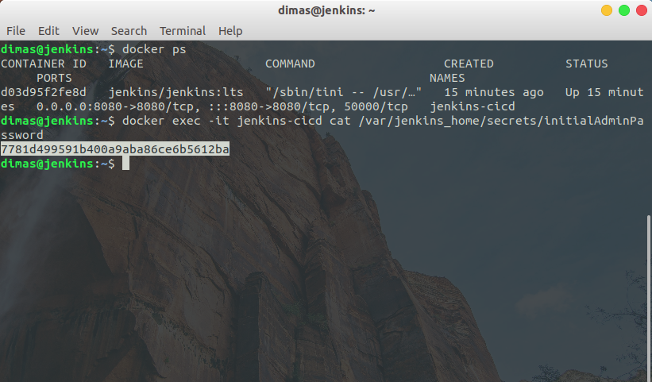

13. buka subdomain `cicd.dimas.onlinecamp.id` pada browser dan `paste` password yang sudah disalin

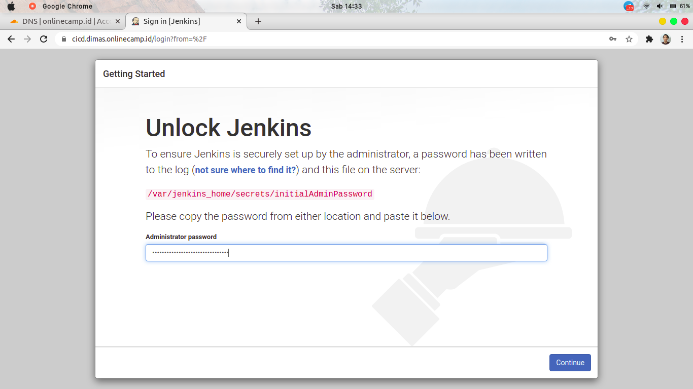

14. pilih `Install suggested plugins` agar beberapa plugins terinstall secara otomatis

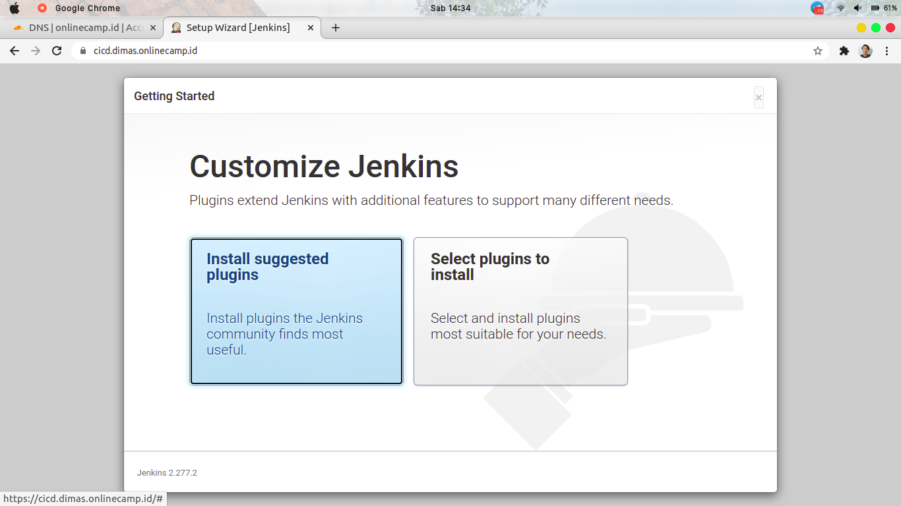

15. tunggu hingga proses instalasi selesai

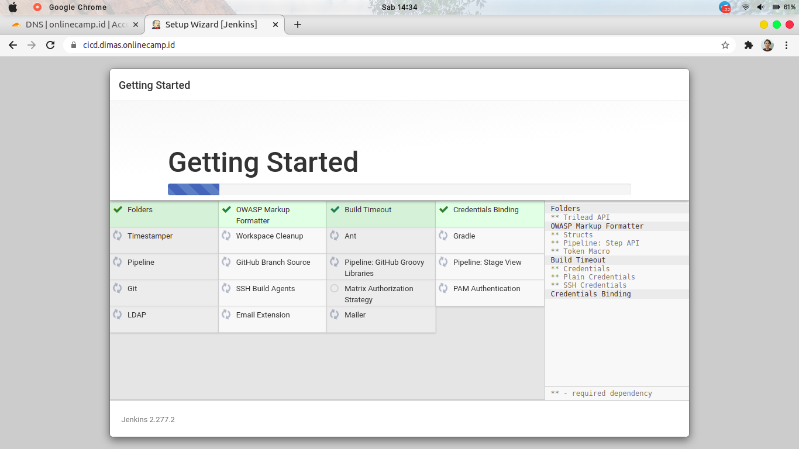

16. create akun user untuk login ke jenkins

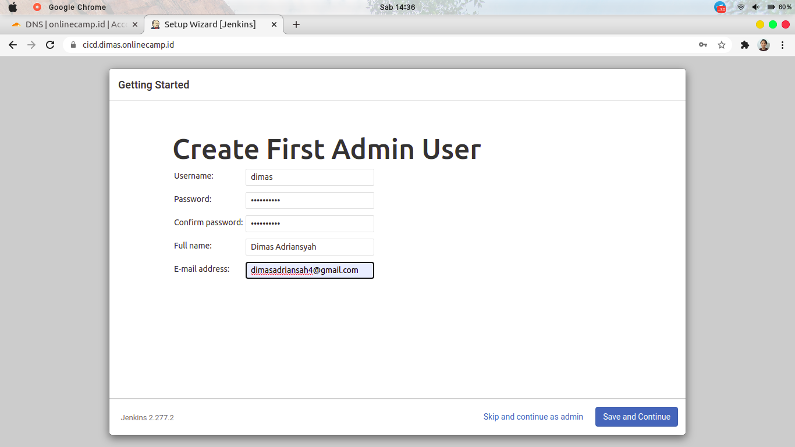

17. masukan URL subdomain `server-jenkins`

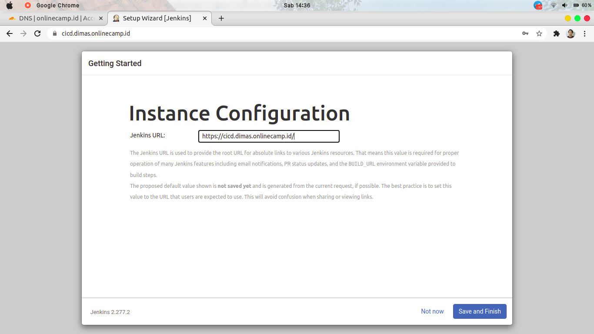

18. dan jenkins berhasil ter-install

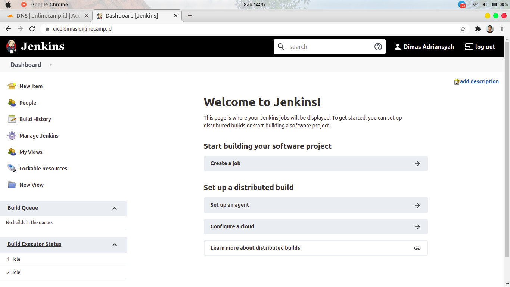
