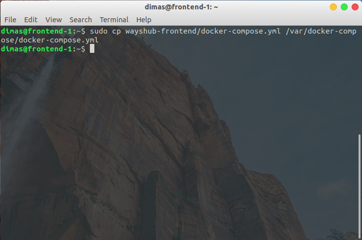
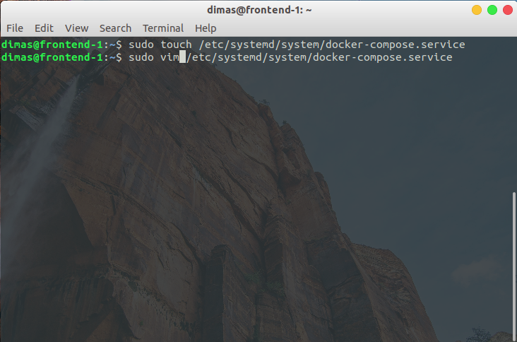
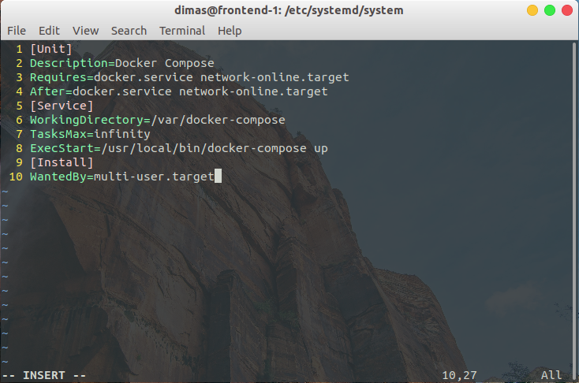
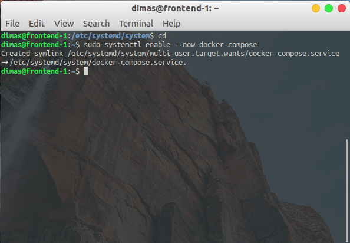

# AUTO RUN DOCKER-COMPOSE AFTER BOOTING

1. pertama, buat working direktori pada `/var/<nama-direktori>` untuk `docker-compose`


2. jika sudah, copy/create file `docker-compose.yml` ke working direktori 

```
sudo cp wayshub-frontend/docker-compose.yml /var/<nama-direktori>
```



3. lalu buat file pada `/etc/systemd/system/docker-compose.service` untuk service docker-compose



4. edit file service tersebut seperti dibawah ini



5. terakhir, enable docker-compose dengan perintah

```
sudo systemctl enable --now docker-compose
```




