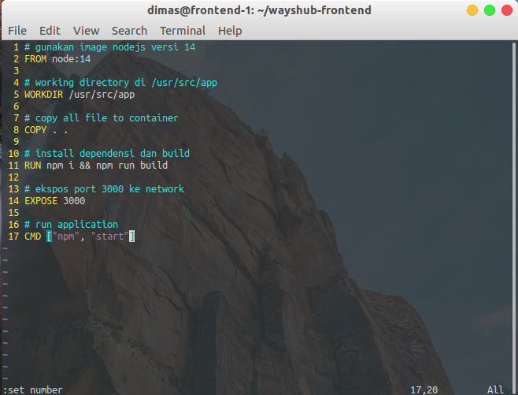

# DOCKER - CREATE DOCKER IMAGES FRONTEND

1. pertama, login ke instances frontend dan masuk ke direktori wayshub-frontend. Lalu buat file Dockerfile.

Isikan konfigurasi pada Dockerfile seperti dibawah ini :



2. jika sudah, build images dari Dockerfile yang sudah kita buat dengan perintah

```
sudo docker build -t <username>/<images-name>:<images-tag> .
```


3. selanjutnya, push images yang sudah kita build

```
sudo docker push <username>/<images-name>:<images-tag> 
```


# DOCKER - CREATE DOCKER IMAGES BACKEND

4. login ke instances backend dan masuk ke direktori wayshub-backend. Buat file Dockerfile

Isikan konfigurasi seperti berikut :


5. build images dari Dockerfile dengan perintah

```
sudo docker build <username>/<images-name>:<images:tag> .
```


6. push images backend ke docker hub

```
sudo docker push <username>/<images-name>:<images:tag>
```


7. buka halaman web docker hub untuk melihat images yang sudah kita push pada repository kita


