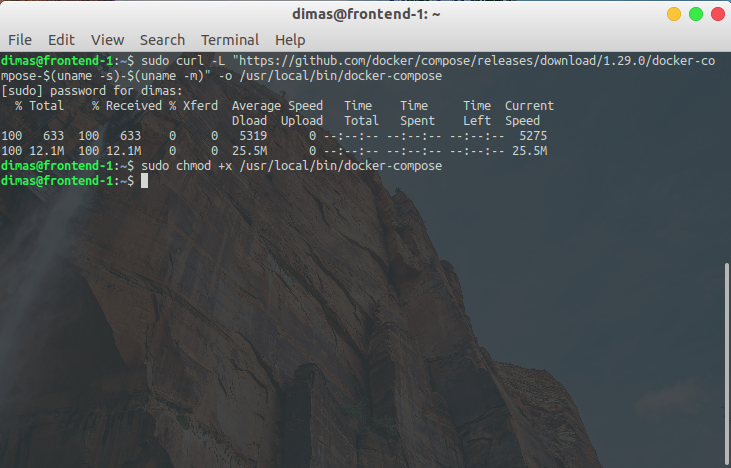
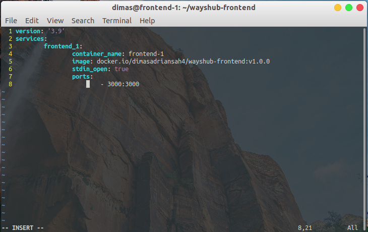
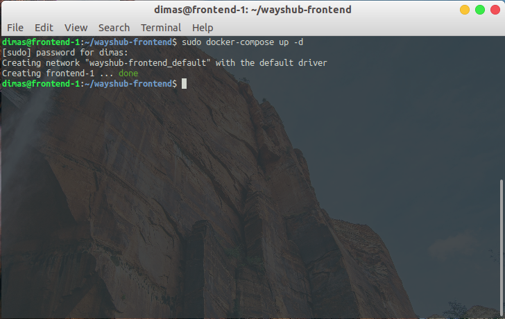
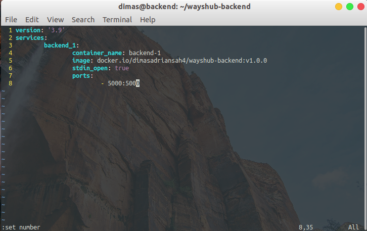
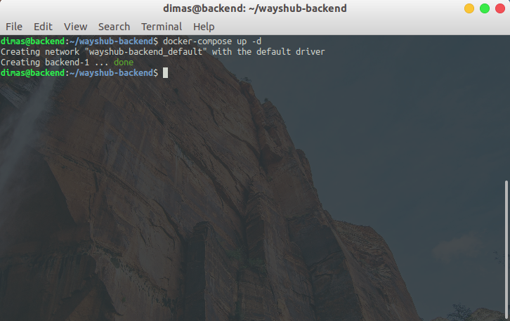
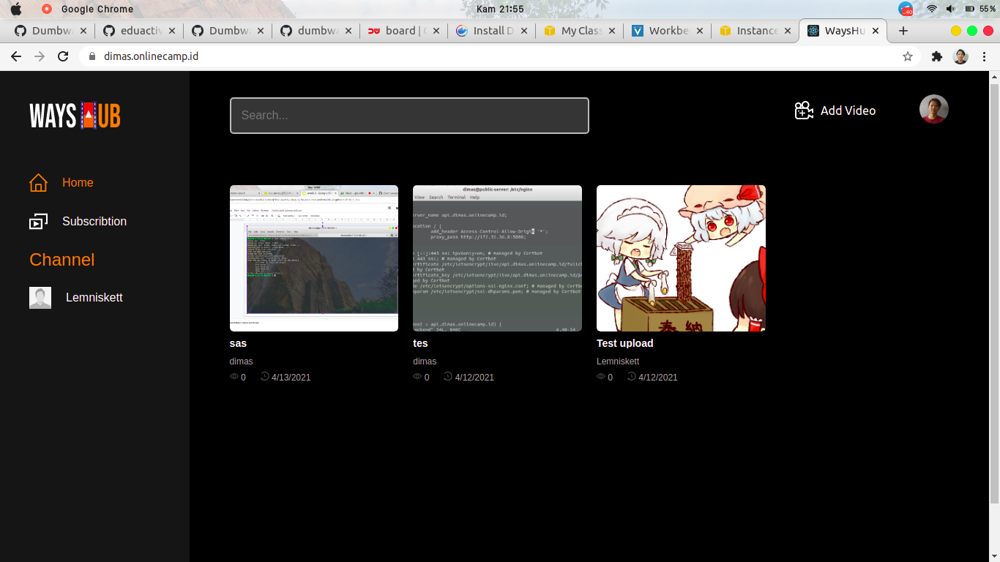

# INSTALL APPLICATION WITH DOCKER COMPOSE

1. masuk ke private instances `frontend` & `backend`. Install docker-compose

```
sudo curl -L \ 
	"https://github.com/docker/compose/releases/download/1.29.0/docker-compose-$(uname -s)-$(uname -m)" \ 
	-o /usr/local/bin/docker-compose
sudo chmod +x /usr/local/bin/docker-compose
```



## FRONTEND

2. buat file `docker-compose.yml` dan edit configuration file seperti dibawah



3. jika sudah, jalankan perintah berikut untuk up running container dari `docker-compose.yml` 

```
sudo docker-compose up -d
```



## BACKEND

4. buat file `docker-compose.yml` dan edit configuration file seperti dibawah



5. up running container

```
sudo docker-compose up -d
```



6. cek apakah aplikasi dari container sudah berjalan


