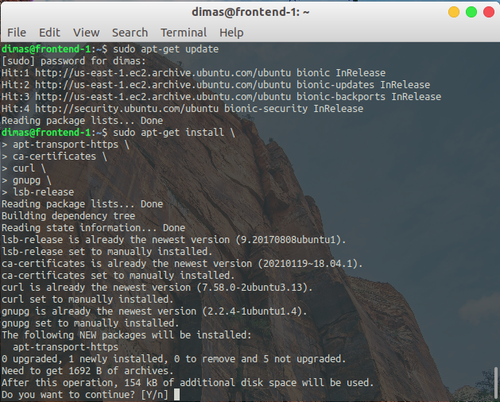
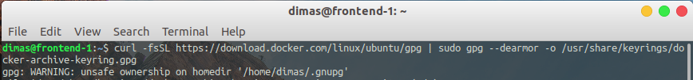
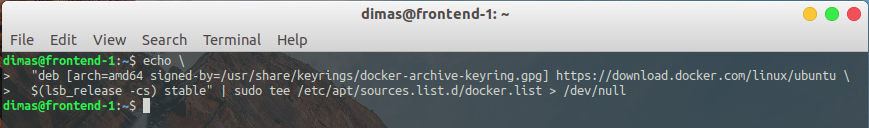
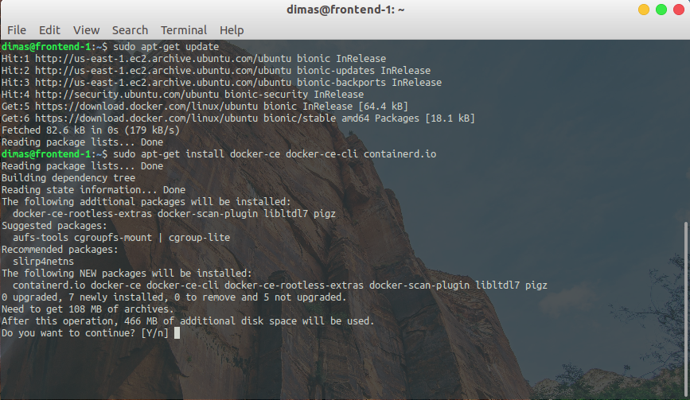
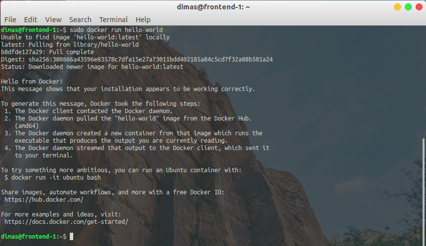
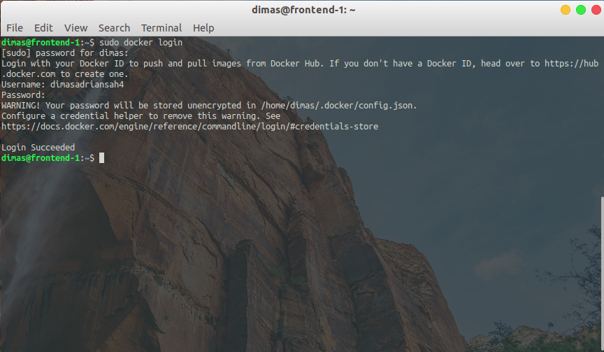

# DOCKER - INSTALL DOCKER

1. update system package dan install packages untuk mengizinkan apt menggunakan repo https

```
sudo apt-get update
sudo apt-get install \
	apt-transport-https \
	ca-certificates \
	curl \
	gnupg lsb-release
```



2. tambahkan official Docker GPG key

```
 curl -fsSL https://download.docker.com/linux/ubuntu/gpg | \
	sudo gpg --dearmor -o /usr/share/keyrings/docker-archive-keyring.gpg
```



3. tambahkan repo stable instalasi docker

```
echo "deb [arch=amd64 signed-by=/usr/share/keyrings/docker-archive-keyring.gpg] \ 
	https://download.docker.com/linux/ubuntu \
	$(lsb_release -cs) stable" | sudo tee /etc/apt/sources.list.d/docker.list > /dev/null
```



4. update lagi system dan install `docker-ce docker-ce-cli` dan `containerd.io`

```
sudo apt-get update
sudo apt-get install docker-ce docker-ce-cli containerd.io
```



5. cek status layanan dan versi dari docker yang sudah diinstal

```
sudo systemctl status docker
sudo docker --version
```


6. jalankan images docker hello world untuk percobaan

```
sudo docker run hello-world
```



7. setelah itu, login ke docker dengan username & password docker hub

```
sudo docker login
```


