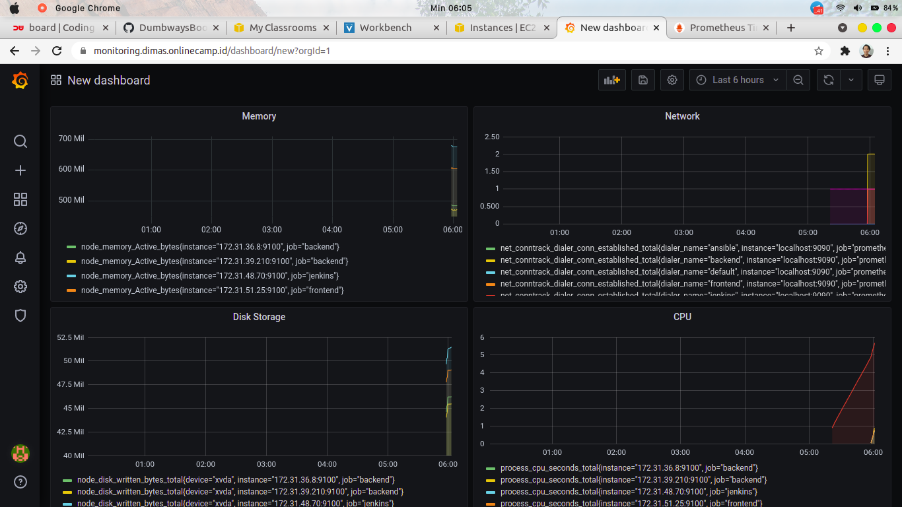

# CONNECT MULTIPLE SERVER TO PROMETHEUS

*agar server monitoring dapat memantau server lainnya maka perlu diinstal node-exporter diseluruh server*

1. disini saya akan menggunakan ansible untuk proses setup. Remote ke server ansible dan create file `node-exporter.yml`


2. jika sudah, buat file `prometheus.yml` untuk mendefinisikan hosts mana saja yang akan dimonitoring.

*file ini nantinya akan dimount kedalam container pada direktori /etc/prometheus*


3. selanjutnya buat file `docker-install-monitoring.yml` yang dimana file tersebut untuk menginstall prometheus & grafana menggunakan docker/docker-compose 


4. buat file `docker-compose.yml` untuk install prometheus & grafana

*file ini akan dicopy ke server monitoring*


5. jalankan file configuration ansible `node-exporter.yml` & `docker-install-monitoring.yml`

```
ansible all --key-file <location-key> -i <inventory> -m ping
ansible-playbook <file-configuration>
```

6. buka browser & akses prometheus


7. akses grafana dan buat add panel


