# SETUP MONITORING SERVER

1. pertama, launch sebuah instances untuk `monitoring` & `automation ansible` di AWS

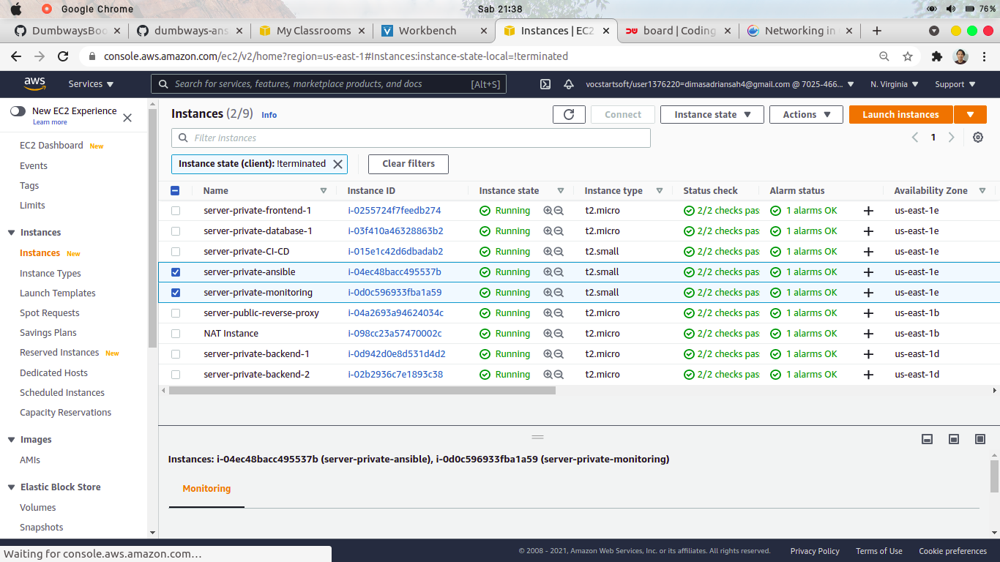

2. lakukan instalasi ansible dan library yang dibutuhkan pada instances ansible

```
sudo apt update
sudo apt install software-properties-common
sudo apt-add-repository --yes --update ppa:ansible/ansible
sudo apt install ansible
```

3. buat file `Inventory` untuk mendefinisikan host yang akan menjadi target host lalu tambahkan ip target kedalam file tersebut dan buat file `ansible.cfg`

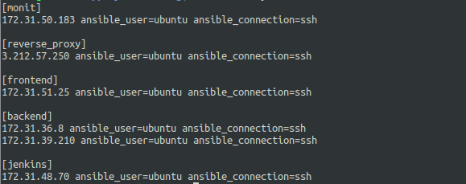
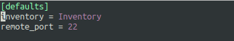

4. jalankan perintah dibawah untuk memastikan apakah host tujuan sudah dapat terhubung

```
ansible all --key-file <location-file> -i Inventory -m ping
```

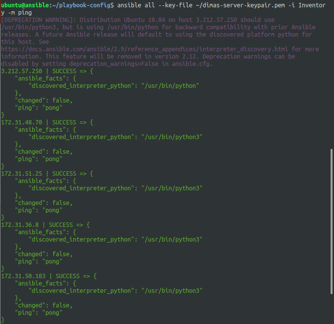

5. buat file `docker-install-monitoring.yml` untuk menginstall docker & docker-compose ke instances monitoring dan menjalankan container prometheus grafana menggunakan docker-compose yang berjalan di `systemd`

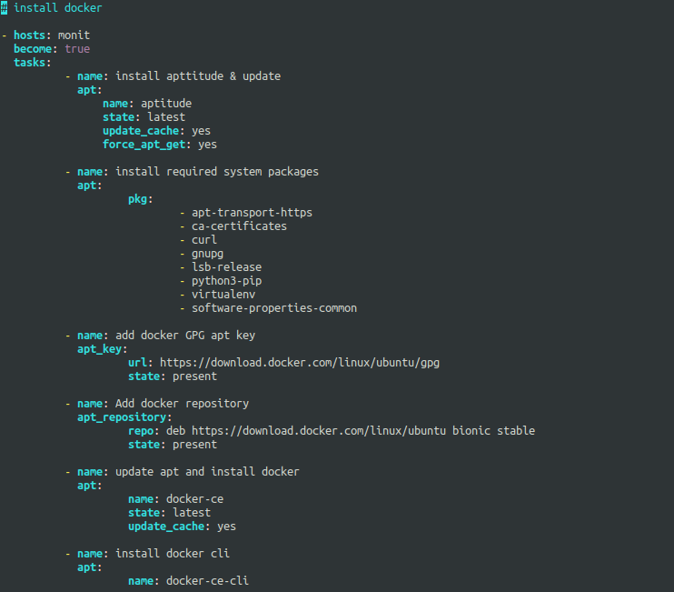
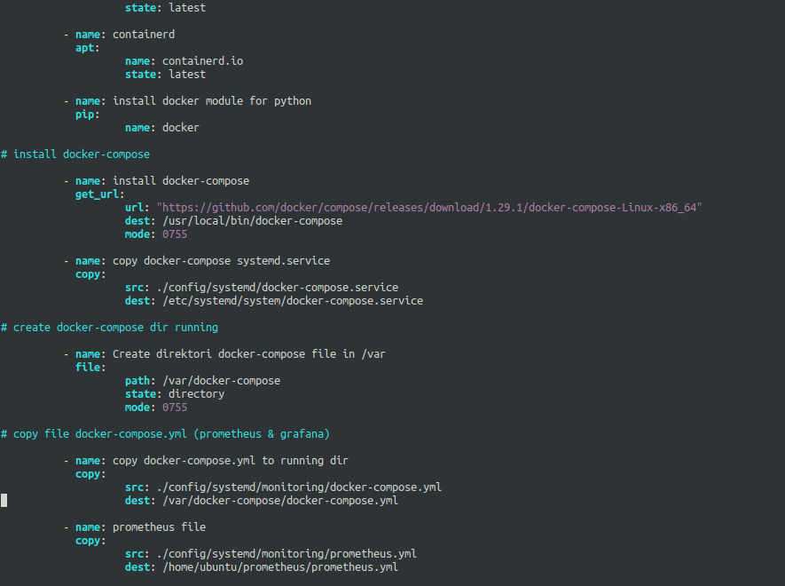

6. buat file `hosts-monitoring.yml` untuk add host ke path dir `/etc/hosts` yang ada pada instances monitoring

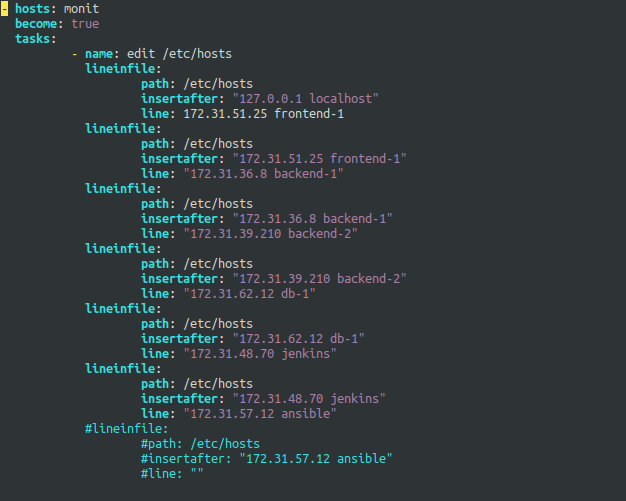

7. buat lagi file `node-exporter.yml` untuk penginstallan node-exporter ke seluruh instance

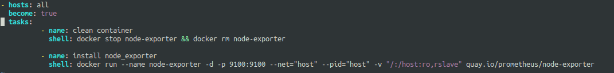

8. persiapkan konfigurasi prometheus yaitu `prometheus.yml` 

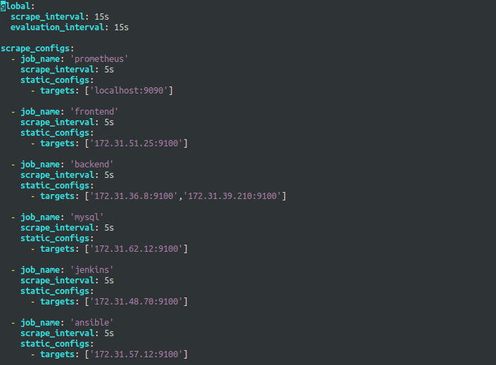

9. persiapkan file `docker-compose.yml` untuk menjalankan container prometheus & grafana

*jadikan lokasi satu file dengan prometheus.yml*

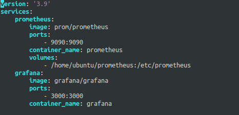

10. setelah itu, jalankan seluruh script configuration ansible

```
ansible all --key-file <location-key> -i Inventory -m ping
ansible-playbook <config-file-name.yml> 
```

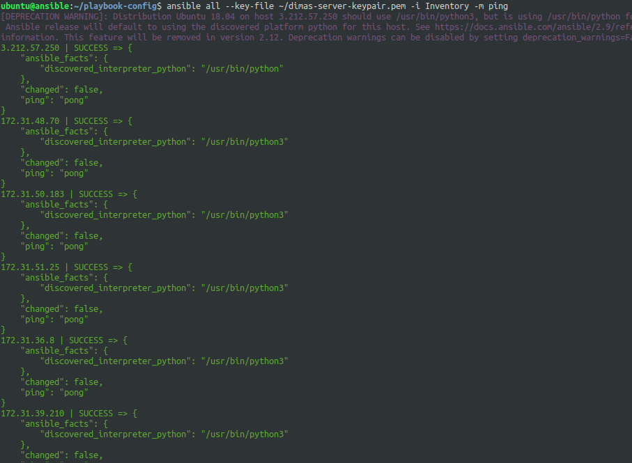
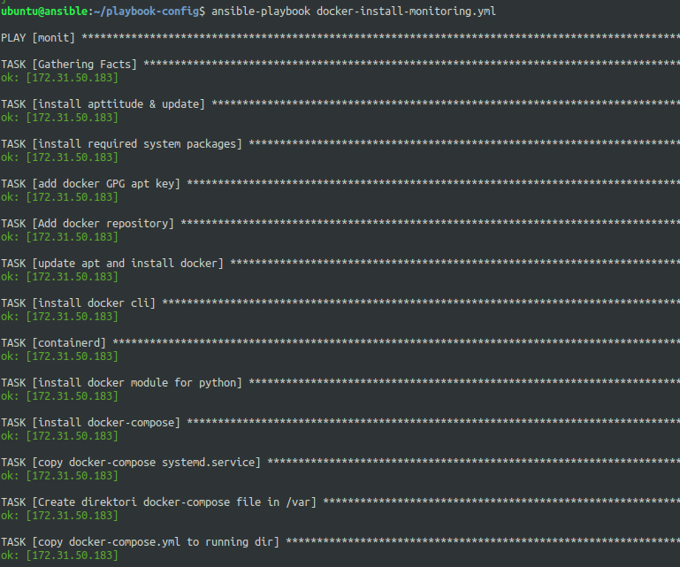
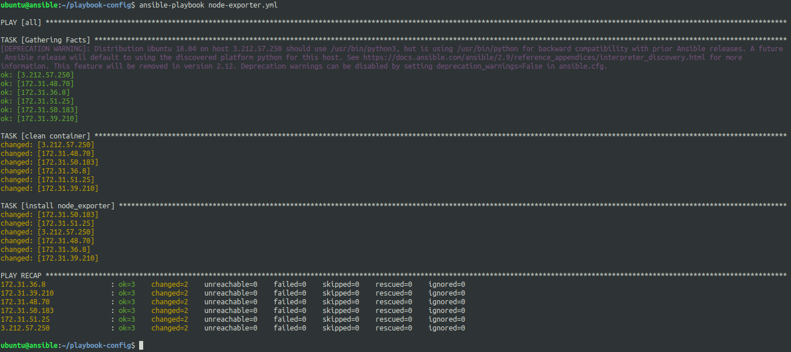

11. masuk ke server nginx dan buat file config baru untuk subdomain `prometheus.dimas.onlinecamp.id` & `monitoring.dimas.onlinecamp.id`

    lalu lakukan konfigurasi SSL untuk https

```
sudo certbot -d monitoring.dimas.onlinecamp.id -d prometheus.dimas.onlinecamp.id
```

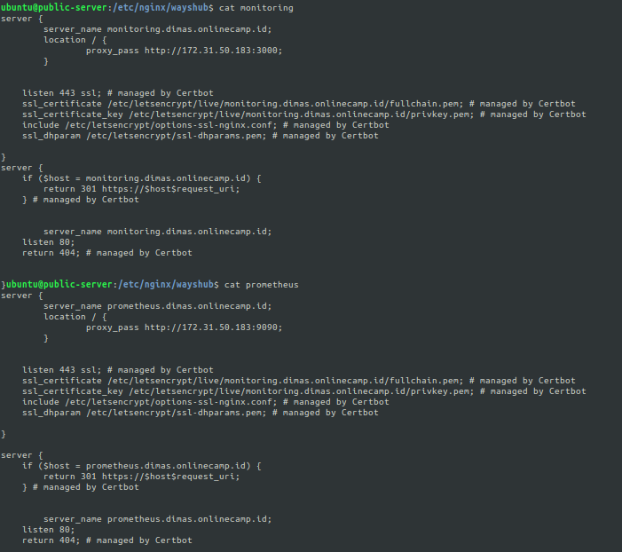

12. buka browser dan akses `monitoring.dimas.onlinecamp.id` login menggunakan user defaults `username: admin` `password: admin`

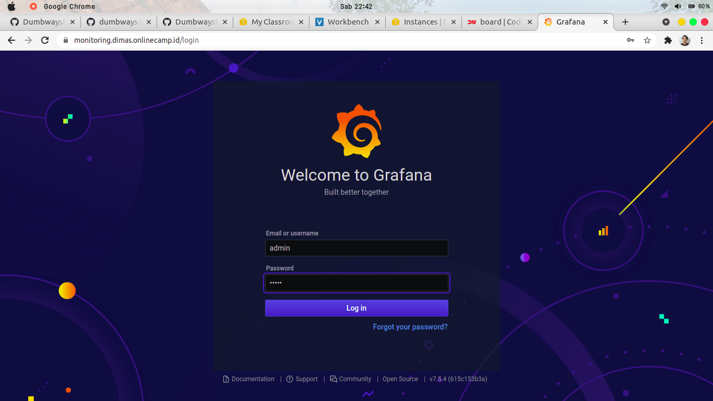

13. pilih data source

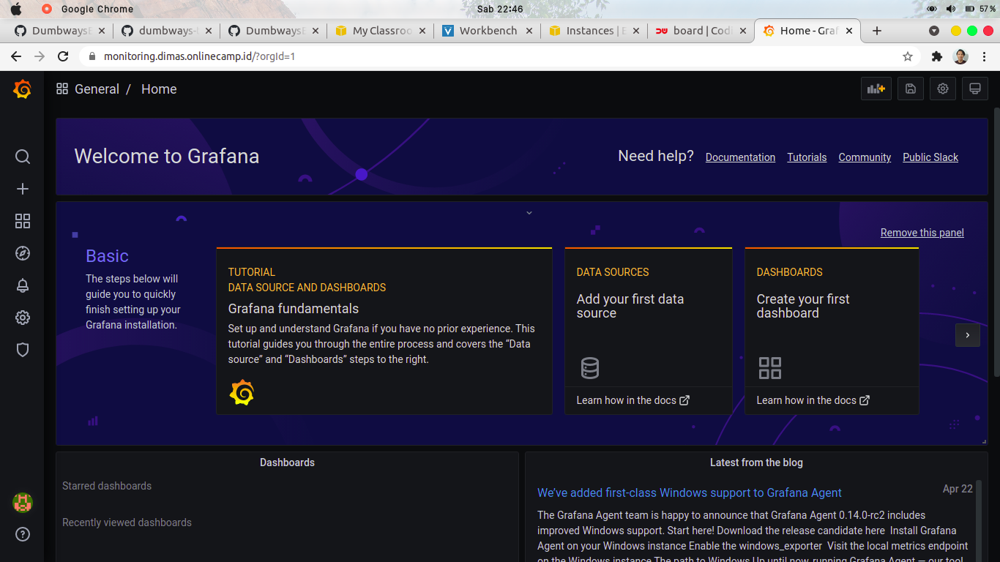

14. add data sources dan pilih prometheus. Masukan URL subdomain dari prometheus

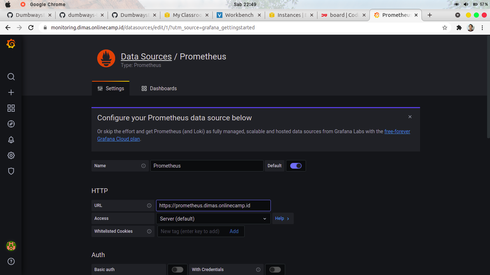

15. save & test

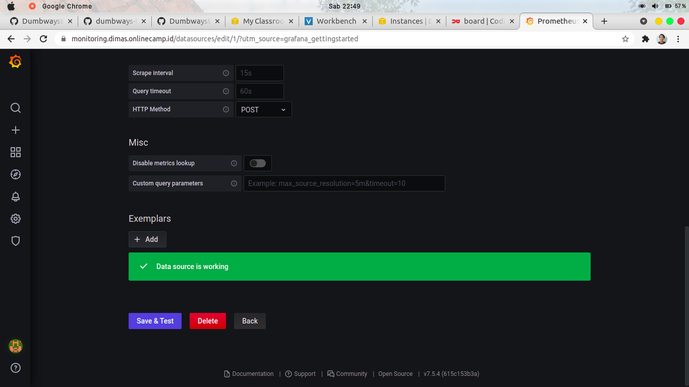

16. create dashboard and add panel

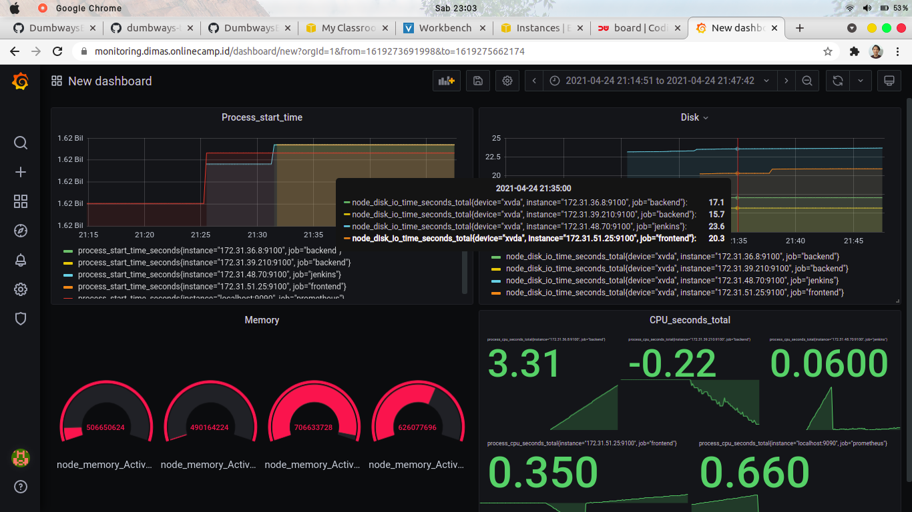

17. setelah itu, cek prometheus

*server ansible & mysql tidak up karena belum saya install docker*

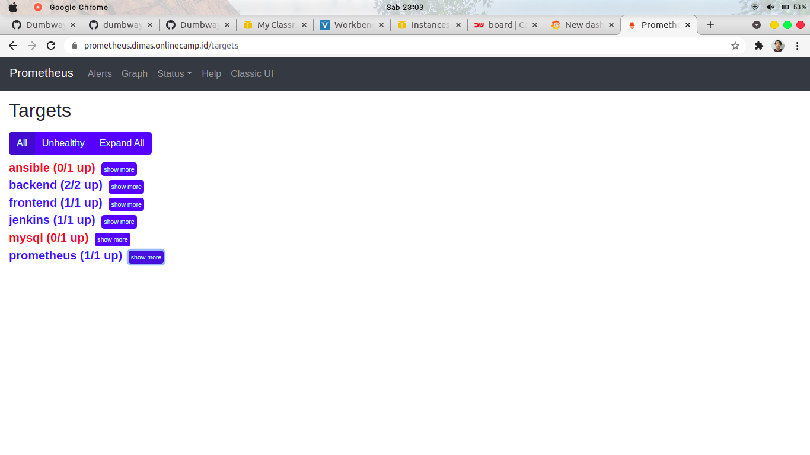

 

