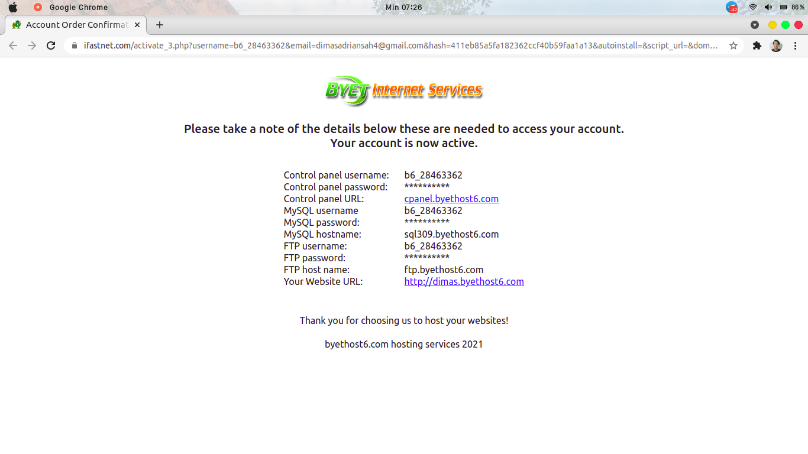
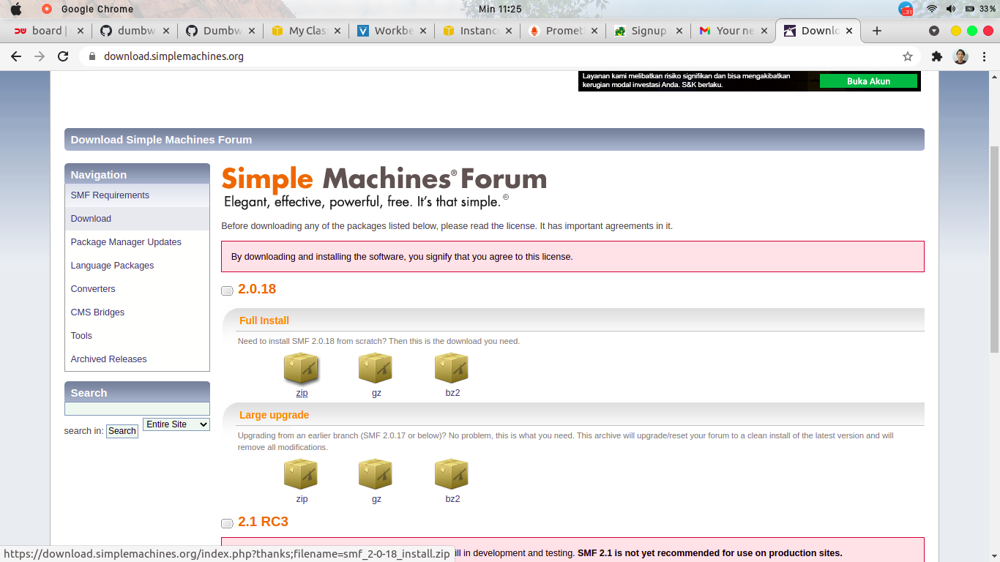
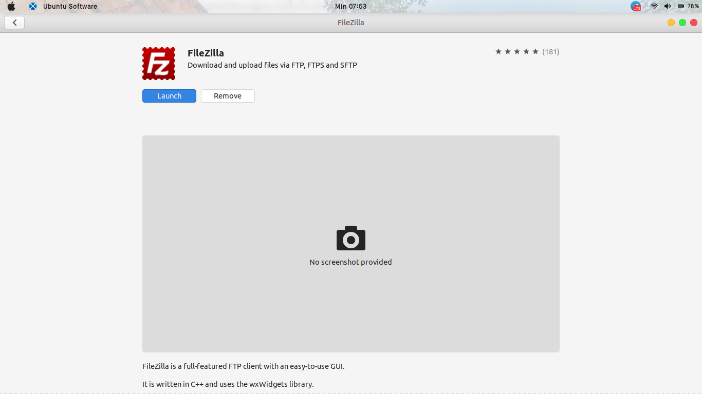
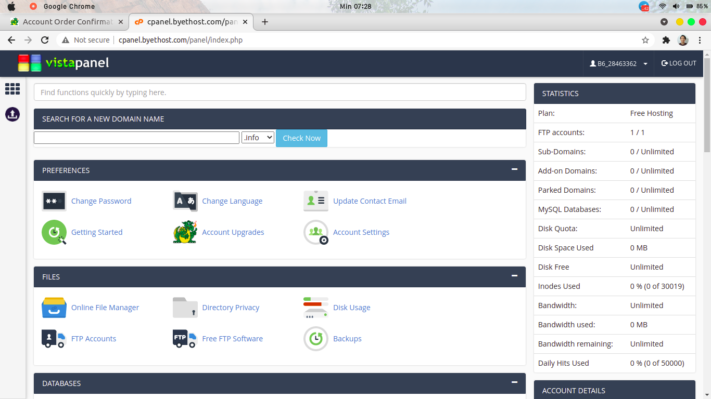
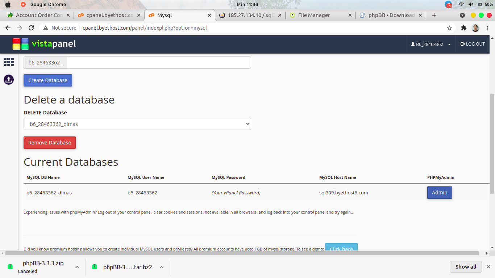
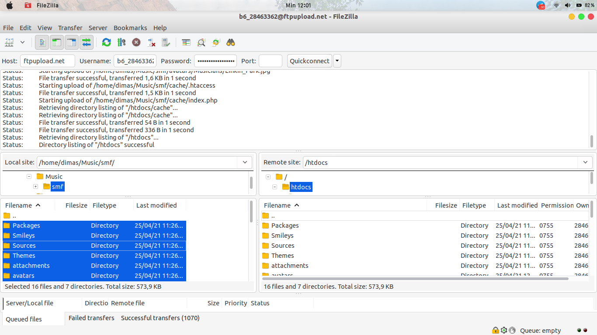
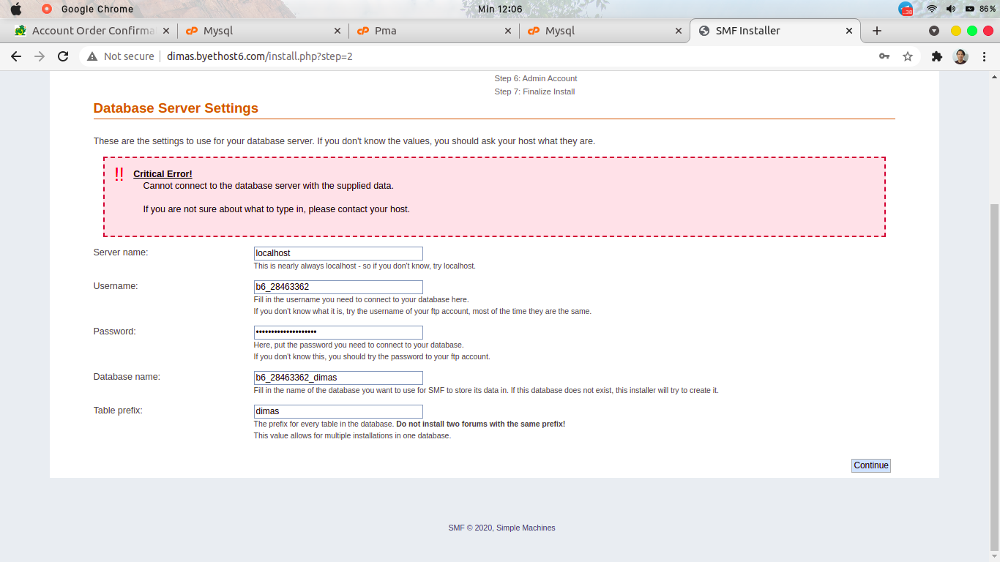
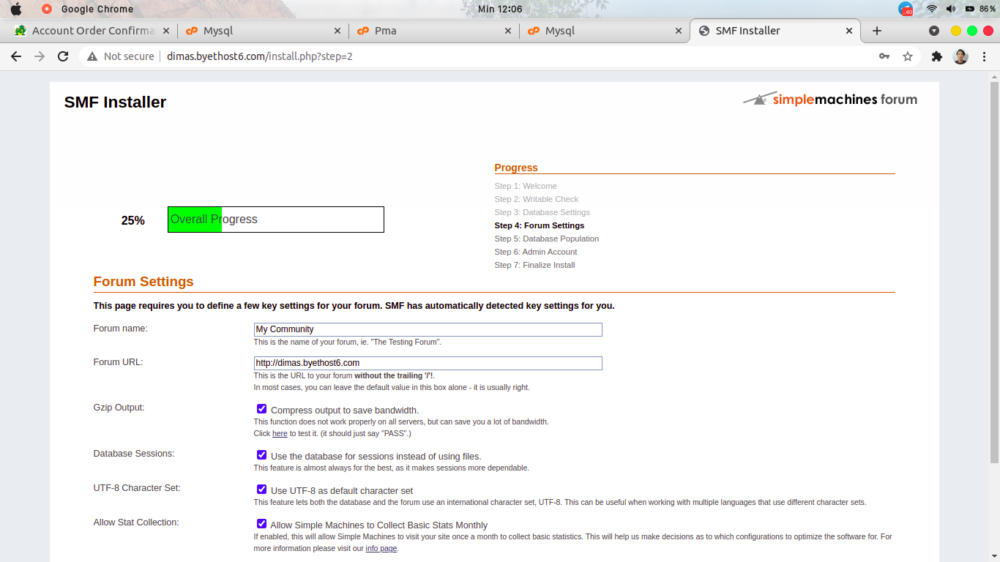
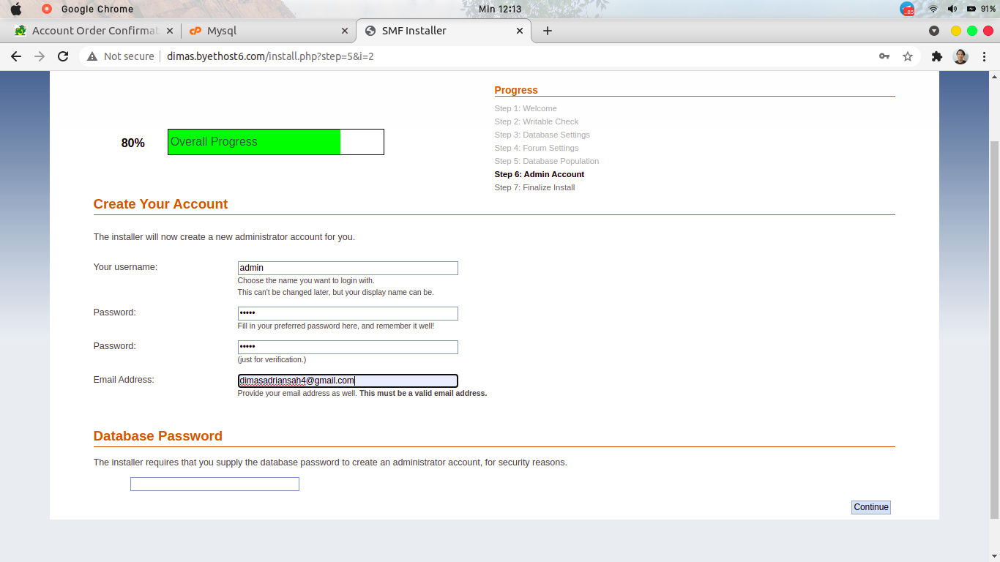
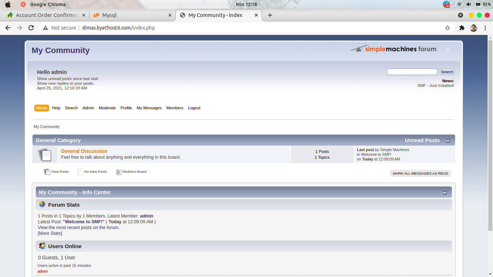

# DEPLOY PHP APPLICATION IN CPANEL

*untuk cpanel saya menggunakan* [byet.host](https://byet.host) *dan akan mendeploy aplikasi PHP* [Simple Machine Forum](https://www.simplemachines.org/)

1. pertama, buat akun cpanel melalui `byet.host` 

2. download simple machine forum

3. download FileZilla untuk melakukan transfer file ke cpanel

4. jika sudah, login ke [cpanel.byethost6.com](cpanel.byethost6.com)

5. create mysql database pada cpanel

6. jalankan filezilla dan remote ftp cpanel untuk transfer file instalasi simple machine forum

*pastikan file sudah diekstrak*

7. buka subdomain untuk melakukan proses install SMF dan isikan username, pass, name, server database yang sudah kita buat

8. biarkan defaults

9. create user administrator baru 

10. jika sudah selesai, buka kembali subdomain pada tab baru dan SMF sudah terinstall

