# CONTINUES INTEGRATION & CONTINUES DELIVERY

1. pertama, buat script ansible untuk create dan install jenkins

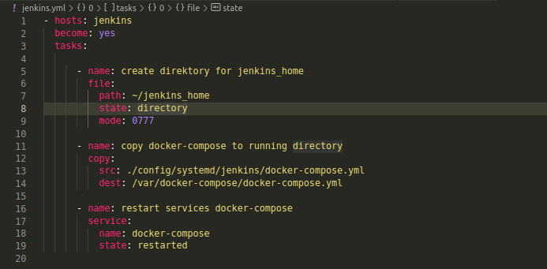

2. buat file docker-compose.yml jenkins yang akan di copy ke direktori `/var/docker-compose` server jenkins

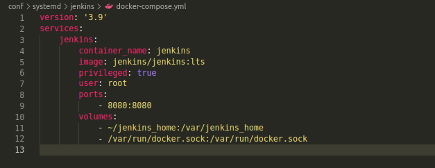

3. apply script ansible tersebut

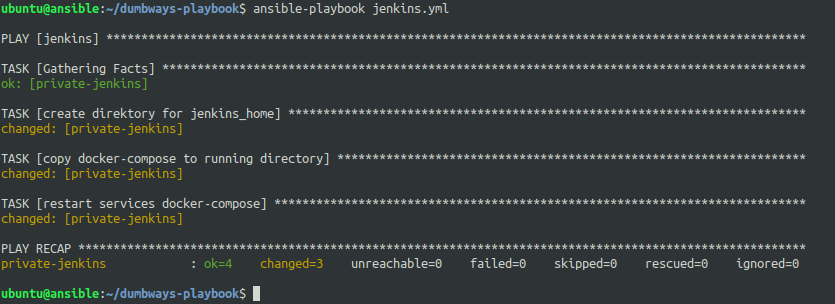

4. masuk ke server jenkins dan copy initial password dari container

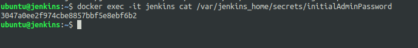

5. buka browser dan akses jenkins lalu salin password tadi

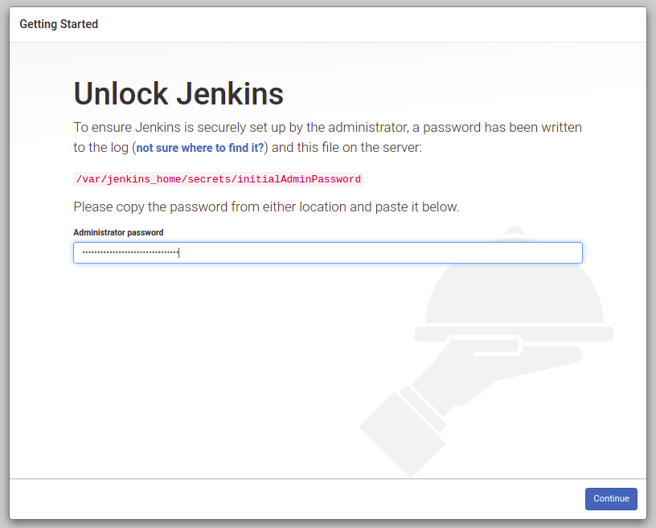

6. pilih Install suggested plugins

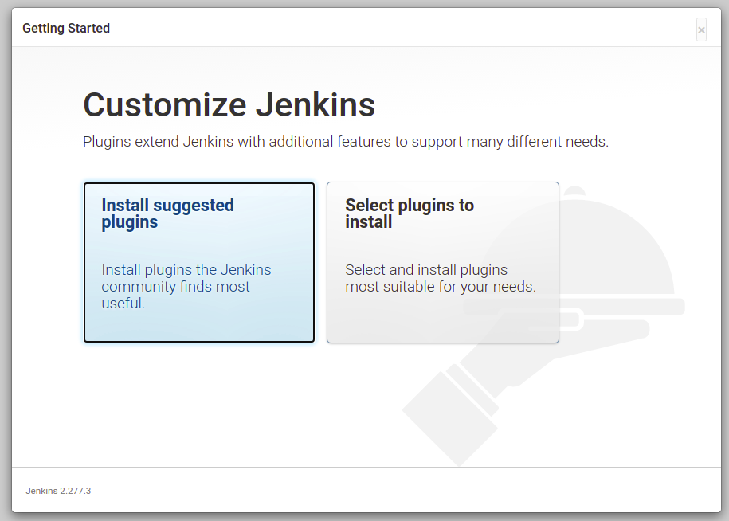

7. create user untuk login jenkins

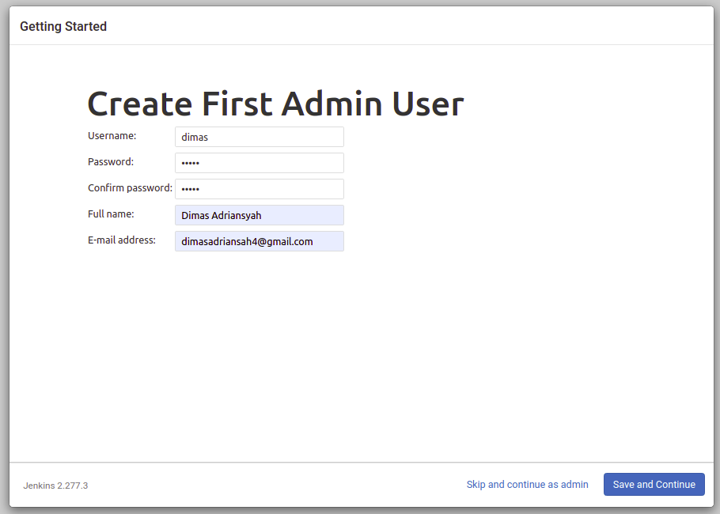

8. jika sudah bisa login, lalu install plugin `Publish Over SSH`

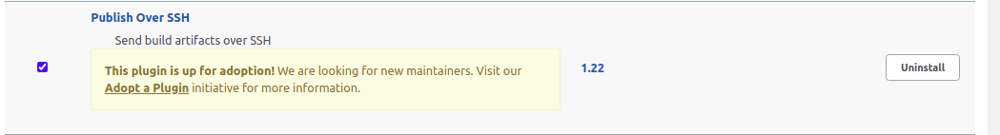

9. setelah itu, tambahkan global credentials dari server jenkins

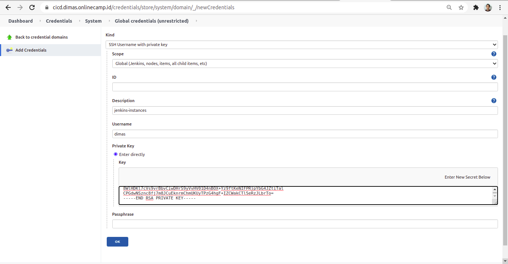

10. add server untuk frontend(1 dan 2)

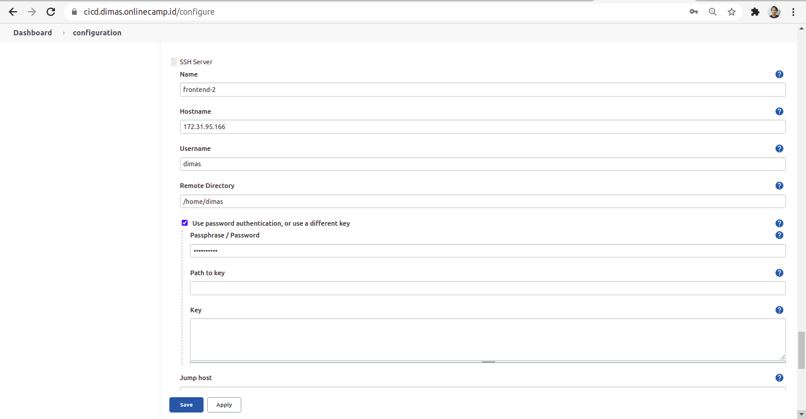

tambahkan public key dari masing" server ke github

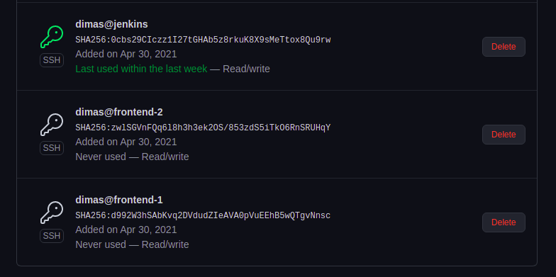

11. jika sudah, create a jenkins job dan pilih Freestyle project

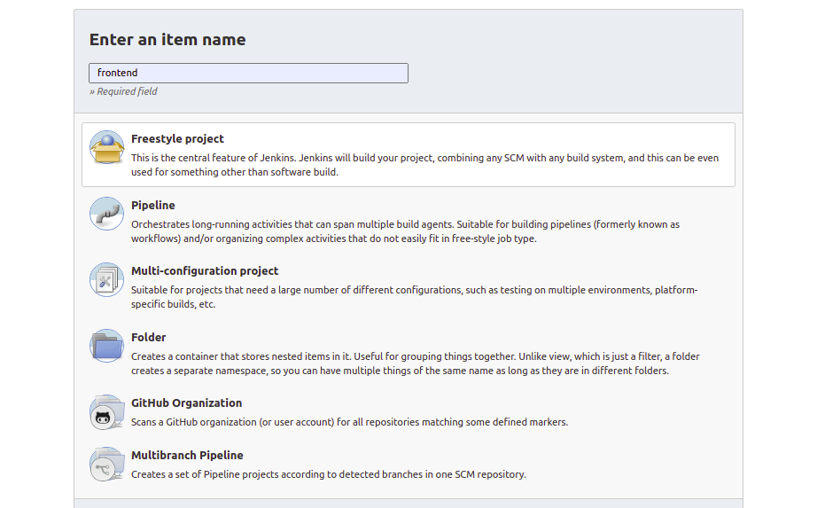

12. pada bagian source code management, pilih git. Isikan URL repo dan pilih credentials server jenkins. lalu atur branch menjadi ke production

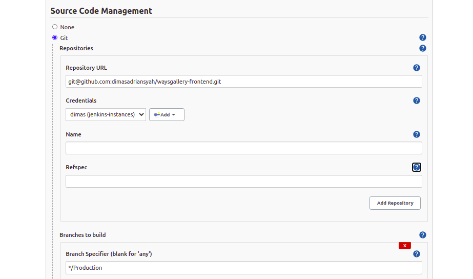

13. pada build triggers, centang github hook trigger

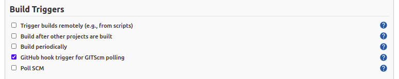

14. pada bagian Build , add build `send files or execute commands over ssh` dan tentukan apa yang akan dilakukan

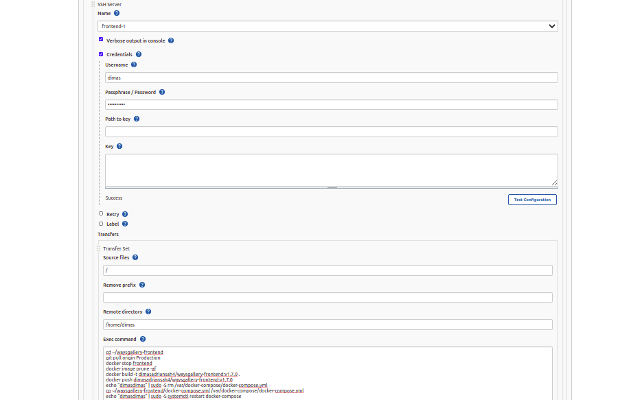

15. jika sudah, tambahkan URL jenkins ke webhook github dengan menambahkan `/github-webhook` dibagian akhir URL

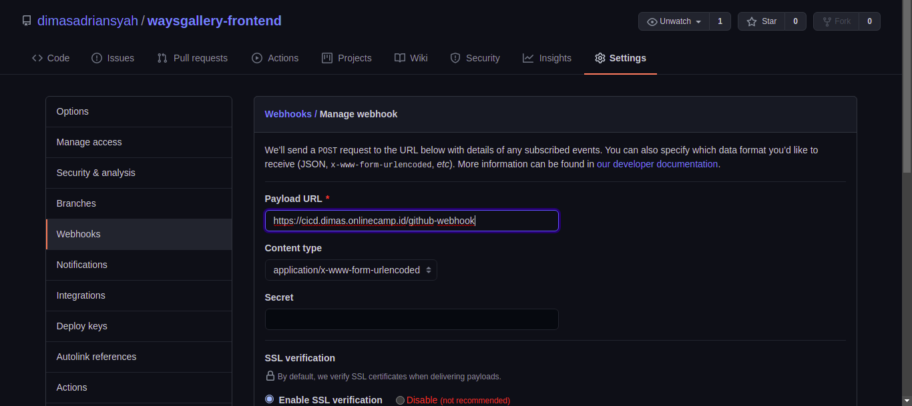

16. lakukan push ke repo pada branch Production

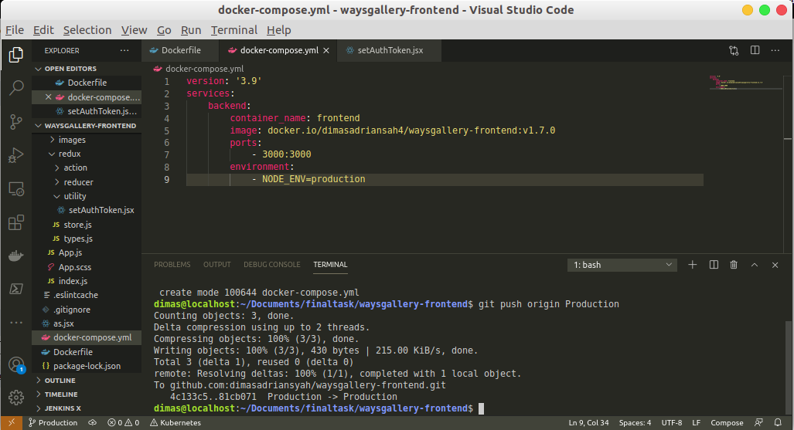

17. maka jenkins akan ke trigger dan melakukan jobs nya

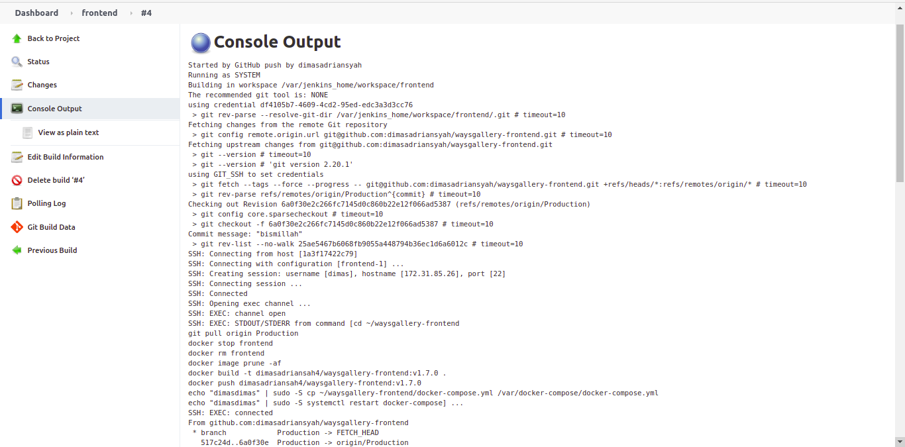

