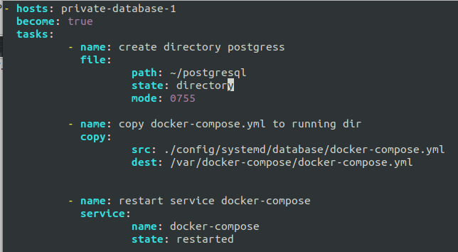

# DATABASE

1. pertama, buat script ansible yang dimana untuk menginstall docker ke server

2. buat file docker-compose.yml untuk postgres 

3. buat file docker-compose.service untuk memproses layanan docker-compose

4. buat script ansible lagi untuk membuat docker-compose running di systemd

5. apply script install docker

6. apply script deploy postgres

7. jika sudah, remote ke server databases dan login ke postgres lalu buat database baru yaitu `waysgallery`

8. buat user database baru dan berikan akses privileges ke databse waysgallery

9. lalu edit file *config/config.json* pada repo backend dibagian production yang nantinya akan kita migrate

10. buat file docker file untuk builds images backend

11. buat script ansible untuk build, push, and run images backend

12. apply script nya

13. remote ke server backend dan container backend sudah berjalan

14. lakukan migrate database pada environment production  didalam container

