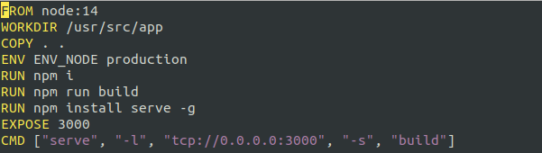
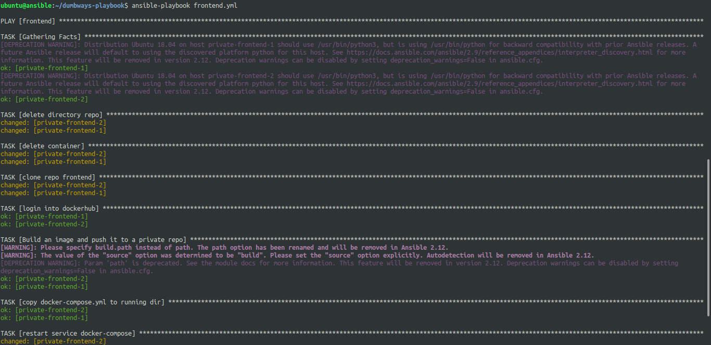
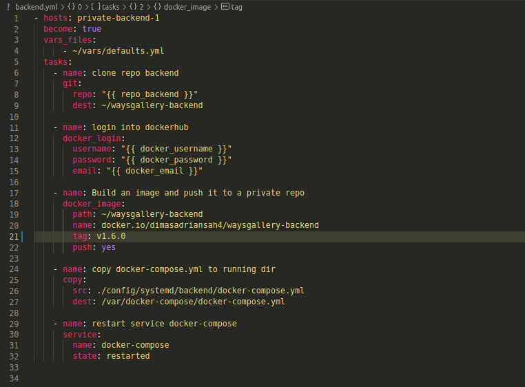
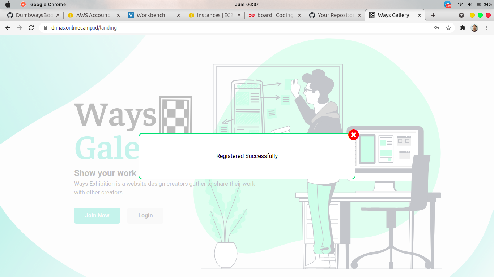

# DEPLOYMENT

## DEPLOYMENT WAYSGALLERY FRONTEND

1. pertama, lakukan clone repository frontend ke local computer kita, lalu buat dan pilih branch Production

2. tambahkan `Dockerfile` pada repo untuk frontend

3. jika sudah, lakukan push ke github pada branch Production

4. lalu masuk ke server ansible dan tambahkan variable frontend & backend yang nantinya akan kita definisikan pada file script ansible fronted

*~/vars/defaults.yml*

5. setelah itu, tambahkan file script frontend.yml yang dimana ini akan mengclone repo ke server target, edit file setAuthToken.jsx, melakuakan login ke docker hub, build custom images dan push, dan copy file docker-compose.yml lalu restart service docker-compose

6. jangan lupa membuat file docker-compose.yml untuk frontend

7. apply script ansible untuk frontend

8. dan sudah ter-deploy

## DEPLOYMENT WAYSGALLERY BACKEND

9. clone repo dan setup to branch Production

10. buat Dockerfile untuk backend

11. lakukan push ke github pada branch production

12. jika sudah, masuk lagi ker server ansible dan buat script untuk build backend

13. buat docker-compose.yml untuk backend

14. apply script backend.yml

15. cek di backend pada file `config/config.json` dan pastikan sudah mengarah ke variable database waysgallery

16. lakukan migrate database

17. jika sudah, coba untuk membuat akun dan login pada aplikasi

