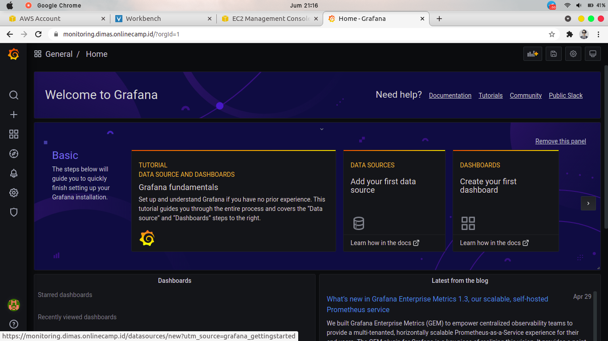

# MONITORING

1. create instances private untuk monitoring

## FILE MONITORING

2. masuk ke server ansible, dan buat file docker-compose.yml untuk running container prometheus dan grafana pada server monitoring

3. buat file konfigurasi prometheus.yml untuk mendefinisikan server mana aja yang mau di monitoring

## FILE SCRIPT ANSIBLE

4. buat file script ansible `monitoring.yml` yang dimana ini akan menginstall prometheus dan grafana pada server monitoring

5. selanjutnya buat file `node-exporter.yml` untuk menginstall node exporter diseluruh server

6. apply script ansible tersebut

7. masuk ke server monitoring untuk memastikan apakah container sudah berjalan

8. selanjutnya, buka browser dan akses URL dari prometheus `prometheus.dimas.onlinecamp.id` dan kita dapat melihat server target yang akan kita monitoring

9. buka juga URL dari grafana dan buat data sources

10. pilih Prometheus dan isi pada bagian URL dengan ip private dan port instances dimana prometheus itu berjalan

11. klik save & test

12. add panel dan dashboard

13. data panel ini untuk memonitor CPU server

14. data panel ini untuk memonitor Memory penggunaan

15. data ini untuk memonitor Input Output dari Disk server tersebut

16. ini untuk memonitor jaringan server

17. selesai 

