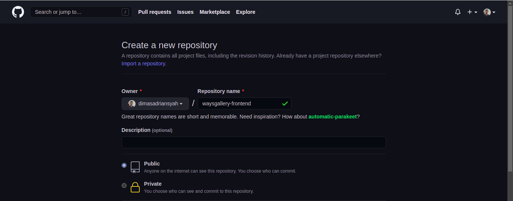
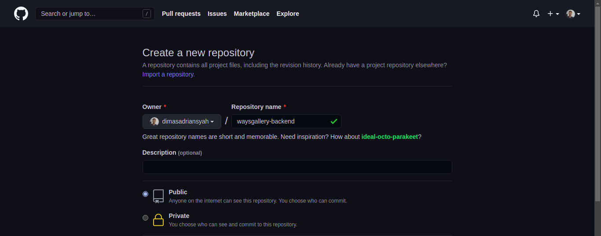
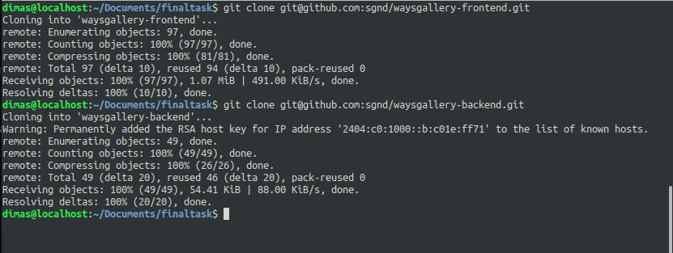
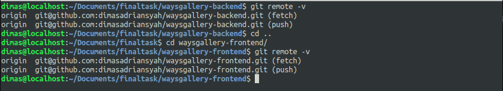
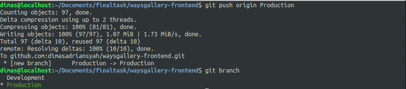
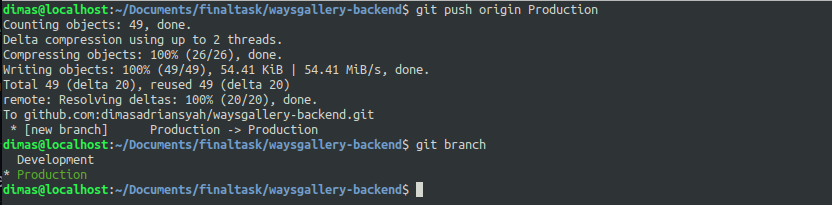

# REPOSITORY

1. buat 2 repository baru untuk `waysgallery-frontend` & `waysgallery-backend`

2. clone repository `waysgallery-frontend` & `waysgallery-backend`

3. ubah git remote menjadi remote origin repository yang sudah kita buat

4. buat branch *Production* & *Development* dikedua repo dan lakukan push

