# SERVER

## SETUP VPC & SUBNET

1. buat vpc defaults baru

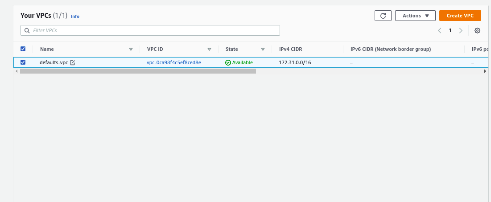

2. tentukan subnet untuk private instances & public instances

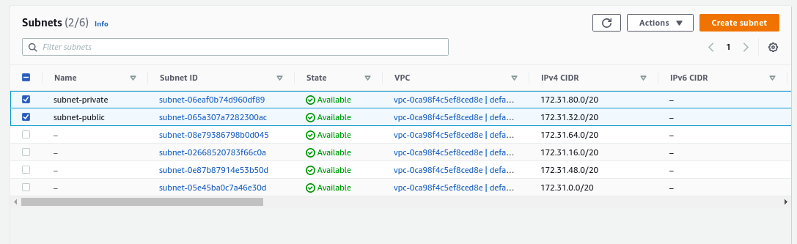

## SETUP SECURITY GROUP

3. buat security groups untuk public instances

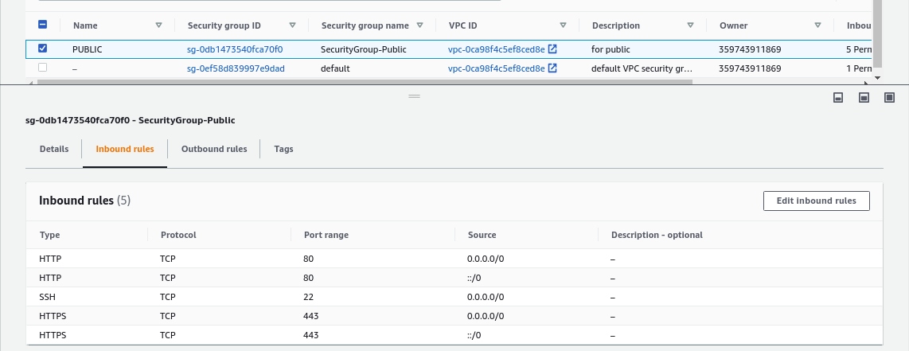

4. buat security groups untuk private instances

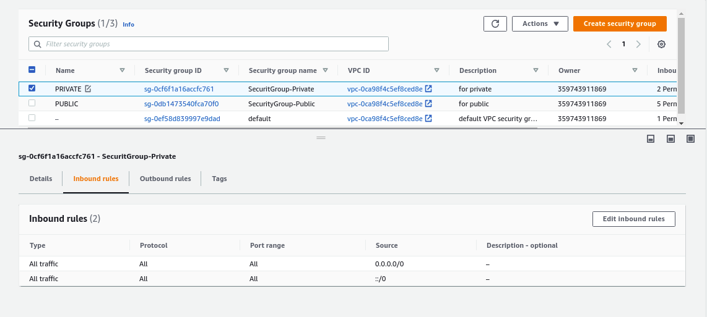

5. terakhir buat security groups untuk NAT instances

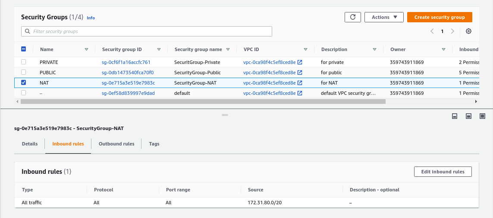

## SETUP NGINX SERVER

6. buat 1 public instances nginx dengan disable auto assign ip publik dan download key file nya

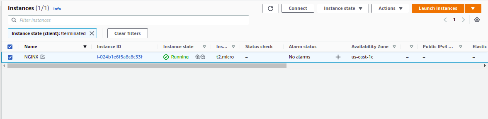

7. buat 1 elastic ip yang nantinya akan di associate ke instances nginx

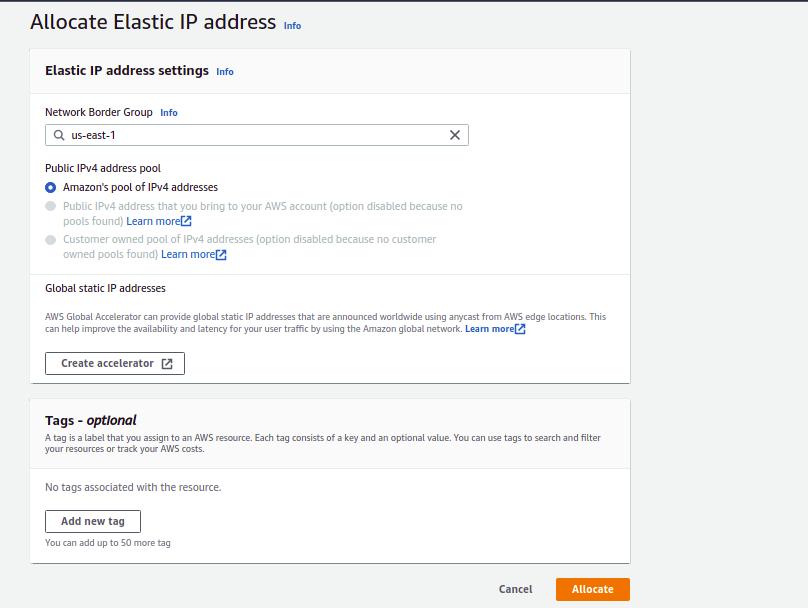

8. associate elastic ip ke instances nginx

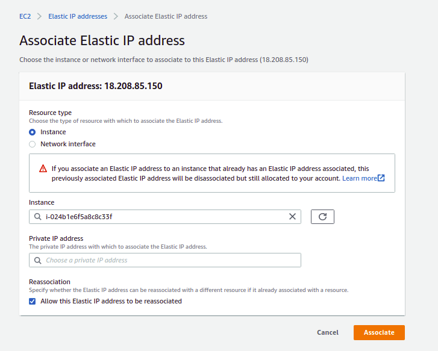

9. copy file key yang sudah didownload ke instances nginx

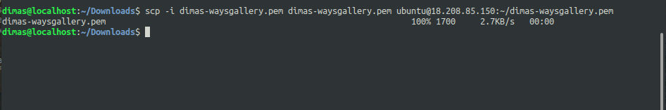

## SETUP INTERNET FOR SERVER

10. buat private instances untuk application

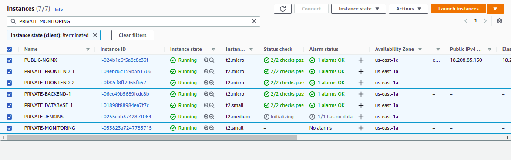

11. jika sudah, buat NAT instances agar private instances dapat terhubung ke internet melalui NAT instances

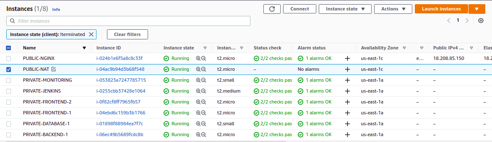

12. edit *source/destination check* pada NAT instances dengan menceklis `Stop`

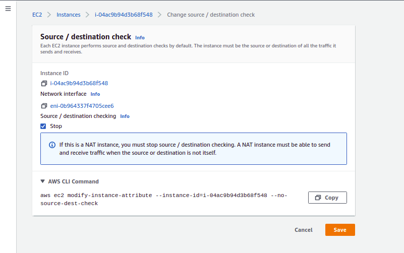

## SETUP ROUTE TABLE

13. buat route table baru untuk private instances

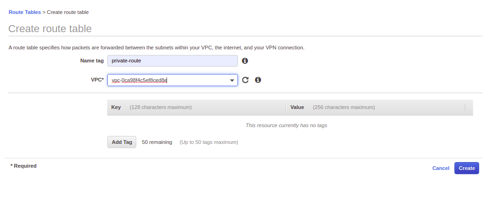

14. edit routes pada route table tersebut dengan menambahkan routes menuju `0.0.0.0/0` melalui NAT instances

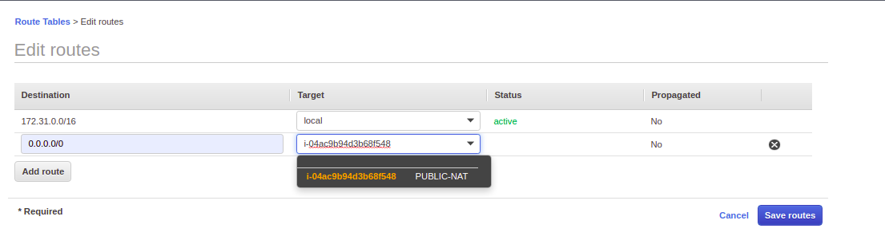

15. associate route table tadi ke subnet private

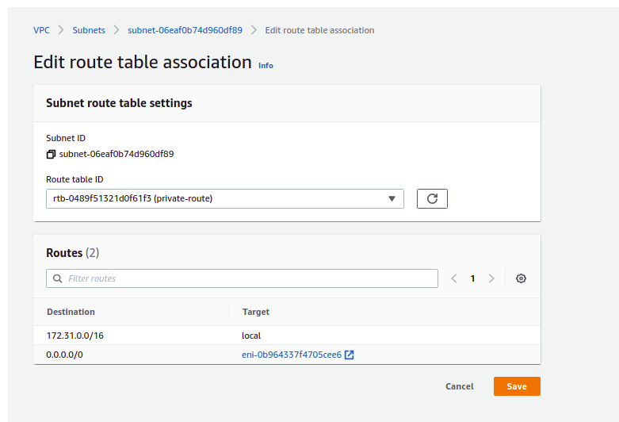

16. test ping ke internet pada server private

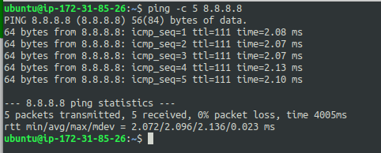
