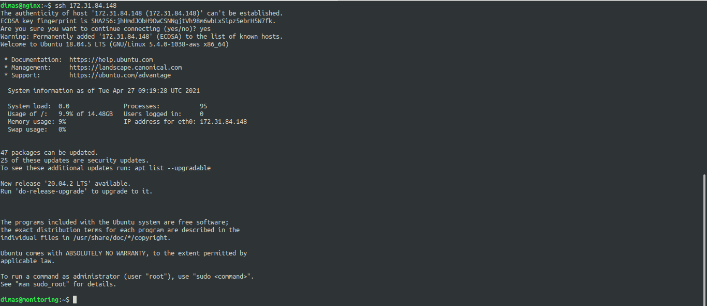

# SSH

## SSH USER
1. lakukan generate ssh-key pada user dimas

2. buat file /.ssh/config yang nantinya untuk tempat dimana private key itu diarahkan

3. buat script file ssh-key.yml untuk proses transfer key dan config ke target

4. apply script file tersebut di user ubuntu *jadi nanti biarkan user ubuntu yang membuat proses tersebut*

5. lakukan ssh pada user yang sama menggunakan user dimas dan hasilnya tidak perlu lagi username dan password

## SSH GIT

6. selanjutnya, copy public key user

7. lalu salin di akun github

8. lakukan ssh ke github

