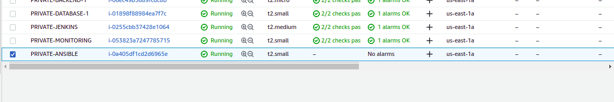
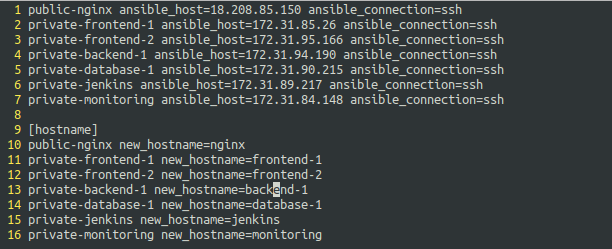
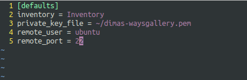
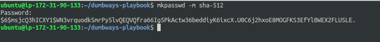
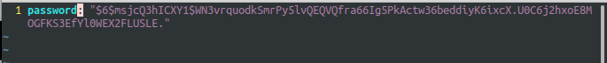
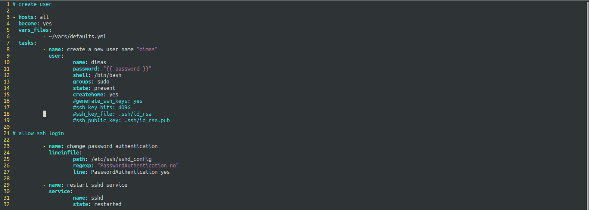
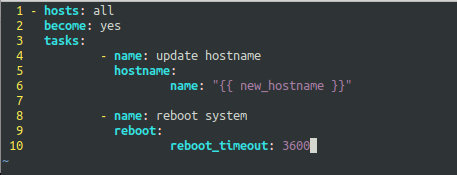
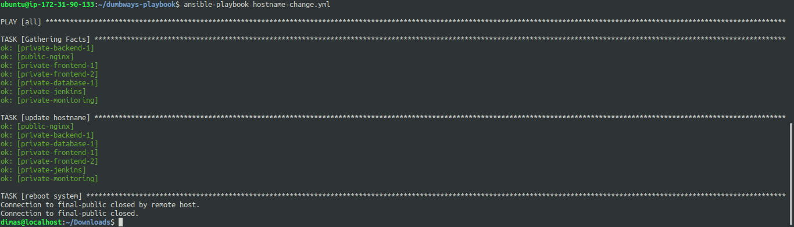
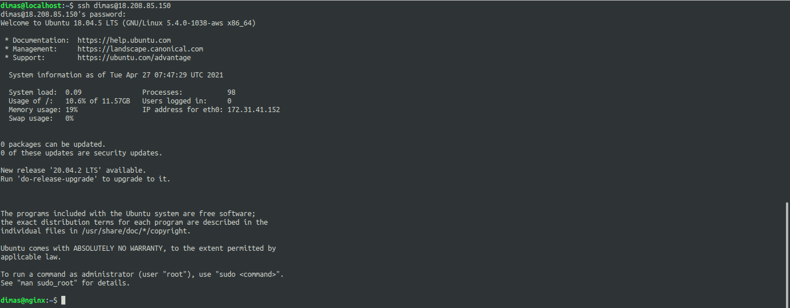

# USER

1. saya akan membuat user menggunakan ansible, pertama saya buat private instances untuk menjalankan ansible



2. lakukan penginstallan ansible dan mkpasswd pada server ansible

```
sudo apt-get update
sudo apt install software-properties-common
sudo apt-add-repository --yes --update ppa:ansible/ansible
sudo apt install ansible
sudo apt install whois
```


3. selanjutnya, exit dari server ansible dan copy private key dari server nginx ke ansible


4. buat file Inventory untuk mendefinisikan host target



5. buat file ansible.cfg untuk mengatur konfigurasi apa saja yang diperlukan



6. lakukan hashing password dan salin hasil outputnya



7. paste hasil hash password tadi kedalam variable vars



8. buat file `create_user.yml` yang nantinya akan membuat user pada server target, definisikan variable password kedalam tasks



9. buat file hostname-change.yml untuk mengubah hostname target



10. setelah itu, lakukan ping connection dengan perintah

```
ansible all -m ping
```


11. apply script create-user.yml dengan perintah

```
ansible-playbook create_user.yml
```


12. apply script hostname-change.yml



13. jika sudah, lakukan login dengan username dan password yang sudah dibuat tadi maka hasilnya akan berhasil


