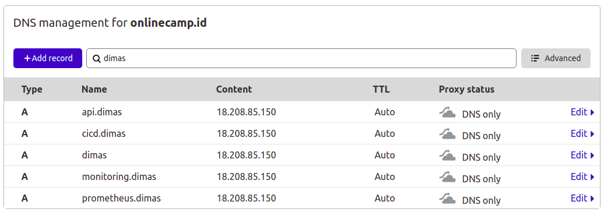
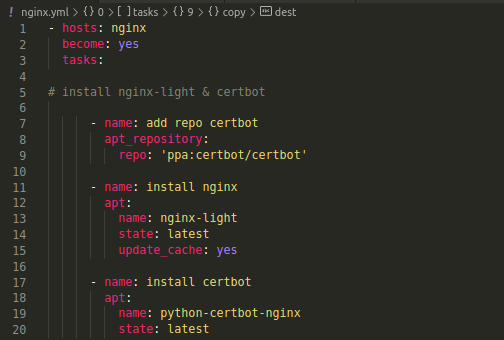
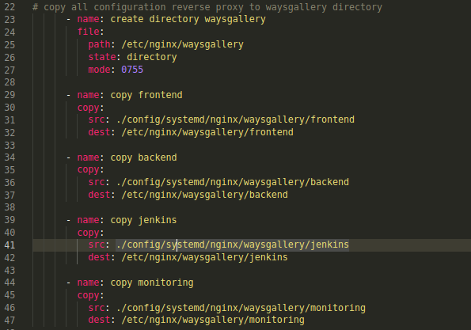
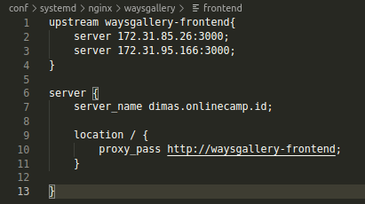
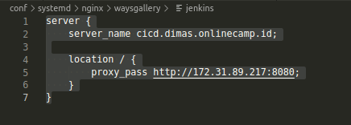
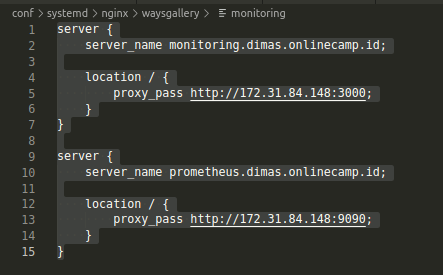
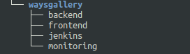
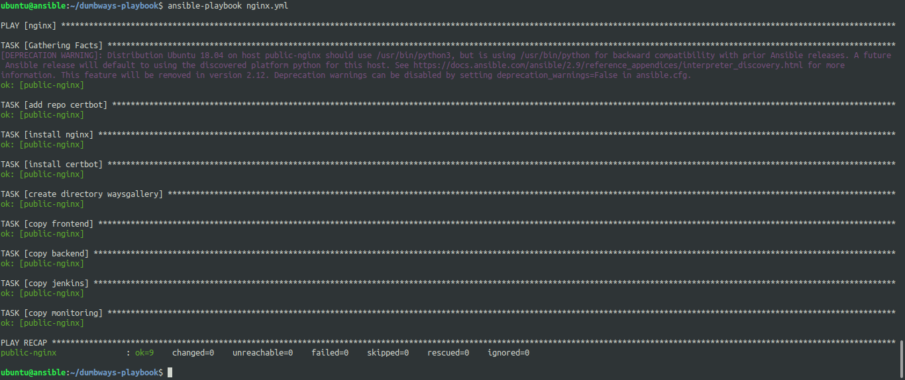
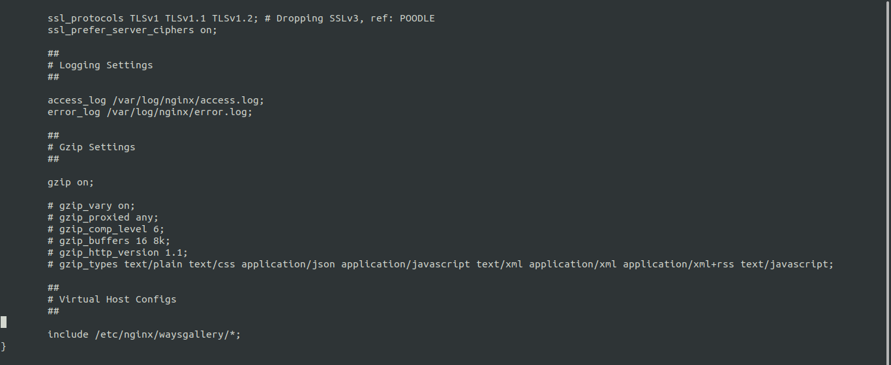
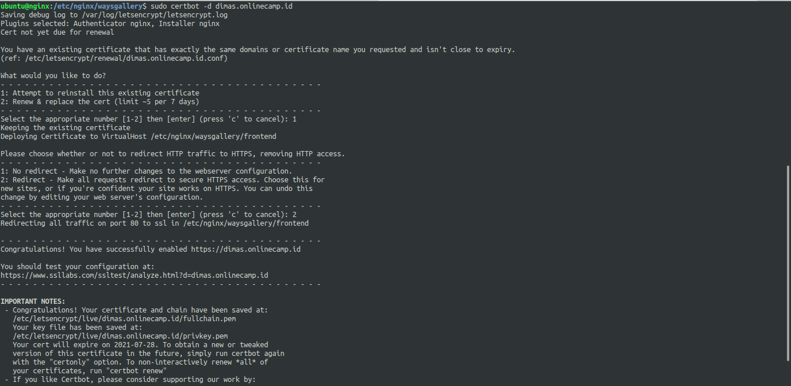

# WEB SERVER

## CLOUDFLARE

1. pertama, buat subdomain untuk beberapa server aplikasi

## INSTALL NGINX & CERTBOT

2. buat script ansible untuk install nginx & cerbot

## COPY FILE CONFIGURATION FOR REVERSE PROXY

3. buat script ansible untuk menyalin file konfigurasi(frontend, backend, jenkins, monitoring) ke nginx 

berikut adalah isi dari file nya

4. apply script untuk nginx

5. jika sudah, login ke server nginx lalu edit file `/etc/nginx/nginx.conf` agar include direktori `/etc/nginx/waysgallery`

6. dan lakukan konfigurasi SSL certbot letsencrypt

